# Transit detection in TESS-like light curves

Finding transiting exoplanets is a needle-in-a-haystack detection problem: a few
per cent of stars host a detectable transiting planet, the signal is a 0.05–1%
dip lasting a few hours, and it sits on top of stellar variability ten to a
hundred times deeper. This repository is an end-to-end pipeline for that
problem — generate the photometry, detrend it, search it, classify it, and
evaluate it the way an imbalanced detection problem has to be evaluated.
It also vets single real stars: `python -m transitml.vet "TIC ..."` downloads,
detrends, searches and scores one target and writes a one-page report, and
`python -m transitml.batch` does the same for a whole sector, with a cache
and a dashboard of ranked candidates. With `--fit`, either fits a limb-darkened
transit model to its candidates and reports the planet's size, impact
parameter and the stellar density the transit implies, with intervals
whose coverage is measured by injection.

**One command reproduces everything in this README:**

```bash
python -m venv .venv && source .venv/bin/activate
pip install -r requirements.txt
python run_pipeline.py            # ~3 min on 4 cores
pytest                            # ~5 min, 532 tests
```

It writes `results/metrics.json`, `results/report.txt`, the trained model
(`results/model.joblib`, used by `vet` below) and six PNGs to `figures/`.
Fixed seed (42), pinned dependencies, deterministic output.

---

## Headline result

2400 light curves, 4.0% of them hosting a transiting planet, 35% held out.

| Scorer | Average precision (68% CI) | ROC-AUC | Precision@20 |
|---|---|---|---|
| Random ranking (chance) | 0.040 | 0.500 | — |
| Baseline: rank by BLS **depth** | 0.097 [0.081, 0.129] | 0.752 | 0.00 |
| Baseline: rank by BLS **depth SNR** | 0.179 [0.149, 0.230] | 0.831 | 0.10 |
| **Gradient boosting on vetting features** | **0.745** [0.671, 0.819] | 0.921 | **0.90** |

**18× better than chance, 4.2× better than the strongest single-statistic
baseline.** Of the 20 candidates the model ranks highest, 18 are real planets;
ranking the same light curves by BLS signal-to-noise gets 2.

Intervals are 68% bootstrap intervals over 2000 paired resamples of the test
set. With 34 positives the point estimate carries ±0.07, so the third decimal
means nothing — but the model out-scores the baseline in **100.0%** of paired
resamples, so the gap does. The version before the occultation change (see the
TOI benchmark below) scored 0.802 on this same split. Repeated 5-fold
cross-validation over all 2400 curves puts that version at 0.744 and this one
at 0.742, so the drop is the split, not the change.

That test set is one draw. On three fresh sectors of 2000 stars from the same
generator, which the model never saw, average precision was 0.62, 0.73 and
0.59; see "Vetting a whole sector" below.

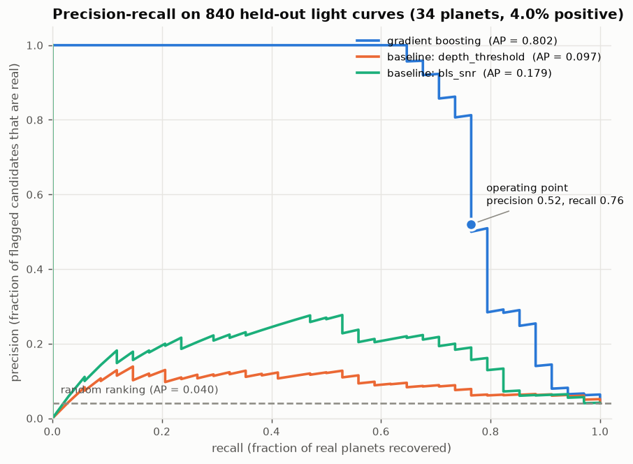

At the chosen operating threshold, on the 840 held-out light curves:

```
                    pred: no planet    pred: planet
  truth: no planet          783              23
  truth: planet               8              26

  precision 0.531    recall 0.765    F1 0.627
  false positives by true object type -> eclipsing binary: 8, variable star: 15
```

---

## Why accuracy and ROC-AUC are somewhat trivial metrics

At a 4% positive rate, the classifier `return 0` scores **96% accuracy** and
finds nothing. Any metric a constant function can win is not measuring the
thing we care about, so accuracy is not computed anywhere in this project —
`tests/test_pipeline.py` asserts the string never appears in the report.

ROC-AUC is reported, and it is not the headline either. The false-positive-rate
axis has ~800 negatives in its denominator on the test set. Going from 5 false
positives to 50 — the difference between a candidate list a telescope-time
allocation committee will fund and one it will not — moves FPR by 5 percentage
points and barely bends the curve. **Precision** has the number of *flagged*
objects in its denominator, which is the quantity that converts into nights of
follow-up, so precision-recall is the right plane and **average precision** is
the headline number.

Average precision has to be quoted against its own null: a random ranking
scores AP = P(positive) = 0.040 here. An AP of 0.80 at a 4% positive rate is a
20× lift; the same 0.80 at a 50% positive rate would be mediocre. The pipeline
always prints both.

### Choosing the threshold

The threshold is not 0.5, and it is not tuned on the test set. It is chosen by
5-fold cross-validation **inside the training split**, as the highest-recall
point whose out-of-fold precision is at least 0.50 *at a one-sided 1-sigma
Wilson lower confidence bound*, and then frozen.

The 0.50 target comes from what the decision costs. A candidate above the
threshold buys a follow-up campaign: seeing-limited ground-based photometry to
check the event is on-target, high-resolution imaging, then radial velocities —
nights of telescope time each. A missed planet costs nothing today; it is still
in the archive and the next sector will find it. So the sensible policy is to
cap the waste rate and take whatever recall that buys. Precision ≥ 0.50 means
at most one wasted campaign per confirmed planet.

**What did not work at first, and what was done about it.** The first version
applied the 0.50 floor to the *point estimate* of out-of-fold precision.
Cross-validation promised precision 0.500 at recall 0.726; the held-out set
delivered **0.407** at recall 0.706. That gap is selection bias in the threshold
itself: taking the deepest point that just clears a precision floor, on
out-of-fold predictions from only 62 positives, picks a point whose precision
happened to fluctuate upward.

The rule now requires a one-sided Wilson score lower bound on the CV precision
(TP over TP + FP at each candidate threshold, `precision_lcb_z = 1.0` in
`EvalConfig`, i.e. one sigma, matching the 68% intervals used everywhere else)
to clear 0.50. The bound never exceeds the point estimate, so this can only
raise the threshold, and `tests/test_evaluation.py` asserts that on random and
real out-of-fold scores. On this run the bound is 0.500 at 81 candidates, the
CV point estimate there is 0.556 at recall 0.726, and the held-out set delivers
precision **0.531** at recall 0.765.

So the correction helped, but one run cannot show that it is enough. On one
earlier run held-out precision was 0.481, below the 0.50 target; on the next it
was 0.520 and on this one it is 0.531, above it. All three are within the 68%
sampling uncertainty of a 50-candidate test sample (about ±0.07) of the target.
In the round that
introduced the rule, the two changes made together were also separated: with the
beta-scaled features (next sections) and the old point-estimate rule the
threshold would have been 0.167 and held-out precision 0.426 (35 false
positives), and the Wilson rule moved it to 0.200 and 28 false positives at
unchanged recall. A one-sigma bound on 62 positives is a modest correction. On
the run at 0.481 the CV-to-test drop (0.561 to 0.481) was larger than it; on
this one (0.556 to 0.531) it is smaller. Raising `precision_lcb_z` or taking the
median over several CV seeds are the obvious next steps if later runs keep
landing below 0.50; neither was tried, because tuning the knob after seeing the
test number would reintroduce exactly the bias it is meant to remove.

---

## The data

**The demo runs on synthetic photometry, because labelled real data requires
injection-recovery.** The generator is astrophysically motivated
rather than decorative — each light curve is built from the components that
appear in a real one:

```
flux = 1
     + stellar variability   sum of 3 harmonics, P ~ log-U(0.4, 25) d, amplitude ~ log-U(1e-4, 8e-3)
     + red noise             1/f^alpha, alpha ~ U(0.8, 2.0), RMS 0.4-2.5x white
     + instrumental ramps    exponential settling after momentum dumps
     + flares                sharp-rise/exponential-decay, strictly positive
     - transit or eclipse    trapezoidal, from real geometry
     + white noise           from a TESS magnitude-to-scatter relation
```

Sampling is one TESS sector: 27.4 days at 30-minute cadence, with a 1-day
mid-sector downlink gap and 3% scattered cadence losses. Each curve is ~1300
cadences.

Three populations, and the second one is the point of the exercise:

| Population | Rate | Label | Why |
|---|---|---|---|
| **Planet** | 4% | 1 | Depth `(Rp/R*)^2`, duration from Kepler's third law and the impact parameter, so depth/duration/period are *correlated the way real transits are*. A classifier cannot cheat on a combination that never occurs in nature. Close-in planets also show their own occultation at phase 0.5, from reflected light and dayside thermal emission. |
| **Eclipsing binary** | 6% | 0 | The astrophysical false positives that dominate real candidate lists. Often grazing and V-shaped, sometimes with a secondary eclipse or an odd/even depth difference. Depths overlap the planet range at the shallow end. |
| **Variable star** | 90% | 0 | Everything else: rotation, pulsation, red noise, systematics. |

Including eclipsing binaries as *labelled negatives* is what makes this a
classification problem rather than a signal-detection problem. It is why
odd/even and secondary-eclipse tests exist in real vetting pipelines, and it is
why the secondary-eclipse test turns out to be the model's most important
feature and odd/even its fourth.

### Structured systematics in the synthetic sector

The noise above is drawn star by star, so nothing in it is shared between
targets. Real TESS systematics come from the spacecraft: every star on a
camera sees the same scattered light, pointing jitter and focus changes, and
every star in the sector sees the same momentum dumps. `--systematics` adds
that layer, drawn once per sector from the seed:

```
+ scattered light   rises into each perigee, 13.7 d apart (the mid-sector gap is one),
                    with a 1-day Earthshine modulation; camera levels 1.0, 0.6, 0.35, 0.2
+ pointing jitter   1/f noise, one series per camera
+ momentum dumps    spacecraft-wide, every 2.5 to 5 d: the cadence is lost and the
                    flux settles back over about 1.5 hours
+ focus settling    after each perigee as the thermal state recovers, per camera
```

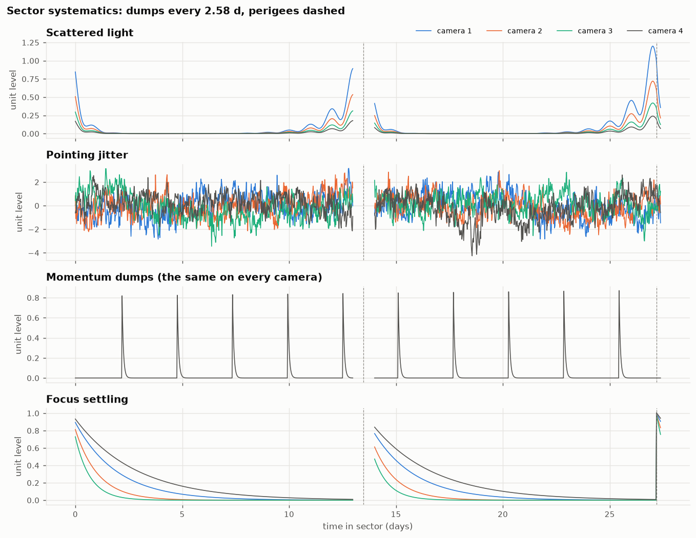

Each star gets a camera and its own coupling to each component, in units of
its white-noise scatter (scattered light 1 to 20, dumps 1 to 8, focus 0.5 to
5, jitter 0.3 to 1.5), so stars on one camera share the shape at different
strengths, as they do after real background subtraction. Scattered light and
jitter can take either sign; dumps and defocus only lose flux. The stars,
planets and binaries are the same draws as without it.

```bash
python run_pipeline.py --systematics                           # results/systematics/
python run_pipeline.py --systematics --systematics-scale 0     # the paired control
python run_pipeline.py --systematics --systematics-components momentum_dumps
```

A scale of 0 keeps the sector's gap and the cadences lost at dumps but adds
no signal, so it is the control for the same stars with and without the
systematics. Turning components off leaves the others exactly as they were.
On the default seed (2400 curves, 96 planets, 34 held out), adding one
component at a time:

| Added to the control | Held-out AP | Planets whose period the search finds (of 96) | Variable stars peaking at the dump period |
| --- | --- | --- | --- |
| nothing (control) | 0.742 [0.666, 0.824] | 86 | 3% |
| scattered light | 0.727 | 87 | |
| pointing jitter | 0.756 | 82 | |
| momentum dumps | 0.762 | 78 | 53% |
| focus settling | 0.775 | 85 | |
| all four | 0.680 [0.603, 0.765] | 76 | 44% |

Full report in
[`results/systematics/report.txt`](results/systematics/report.txt).

**The search pays first, and the components compound.** Momentum dumps
are a periodic, hour-long loss of flux at the same times in every star,
which is a transit as far as a per-star box search can tell. With all four
components, 44% of the variable stars put their strongest BLS peak at the
dump interval or a multiple of it (from 3%), and 365 of the 382 with a
significant peak (SDE above 7) are there. The planets lose too: the search
finds 76 of 96 periods instead of 86, 13 planets have their peak at the
dump period instead of 3, and above a transit SNR of 12 it finds 75 of 80
instead of 79. The classifier loses 0.06 in average precision, mostly on
the false-positive side: at the threshold it flags 62 stars with 24 planets
among them, against 54 with 26. Of the 317 held-out variable stars whose
peak sits at the dump period it flags 17 (5%), against 16 of the other 436
(4%). Their dips are real but shallow (a median depth of 1.9 times the
scatter, against 5.6 for planets), so the model still calls most of them
noise. No component costs the classifier much on its own (scattered light
alone 0.015, and jitter, the dumps and focus even help, by margins well
inside the interval); the 0.06 comes from all four together.

**It is not learning the sector's dump period.** A model trained on one
sector could simply learn that the dump interval means "not a planet". To
test that, the same population was drawn into two more sectors (seeds 43 and
44, each with its own dump interval, gap and camera series), each with its
own paired control, and the sector 42 model was also scored on them:

| Sector (dump interval) | AP, control → with systematics | Search finds (of 96) | Variable stars at the dump period | Sector 42 model, with systematics |
| --- | --- | --- | --- | --- |
| 42 (2.58 d) | 0.742 → 0.680 | 86 → 76 | 3% → 44% | |
| 43 (4.33 d) | 0.662 → 0.611 | 75 → 71 | 4% → 32% | 0.617 |
| 44 (2.52 d) | 0.677 → 0.552 | 82 → 66 | 2% → 43% | 0.530 |

Scored on a sector it never saw, the sector 42 model does about as well as
that sector's own model: 0.617 against 0.611 on sector 43, and 0.530 against
0.552 on 44. That is no worse than the same model transfers without
systematics, where there is no dump period to learn: 0.570 against 0.632 on
sector 43, and 0.754 against 0.747 on 44. Both gaps are inside one run's
interval. What does vary is how much a sector suffers: the paired drop is
0.06 in sector 42, 0.05 in 43 and 0.13 in 44, where the search also loses
the most planets. Sectors 42 and 44 dump at nearly the same interval, so the
interval alone does not set the cost.

Every comparison here is paired for a reason. The control differs from the
same seed's run without `--systematics` by up to 0.07 in average precision
(0.00, 0.03 and 0.07 on seeds 42, 43 and 44), only because the shared gap
and the dropped dump cadences change every star's sampling, and the default
model scores 0.63 to 0.75 across these three seeds, a spread about as wide
as the bootstrap interval of a single run. One synthetic sector is not the
number to expect, with or without systematics.

### Designed for real data to drop in

`transitml/data/base.py` defines `LightCurveSource`; nothing downstream of it
knows whether a curve was simulated or downloaded. There are two
implementations:

- `transitml/data/synthetic.py` — `SyntheticTESSSource`, used by the demo.
- `transitml/data/mast.py` — `MASTLightCurveSource`, which pulls real TESS or
  Kepler photometry from MAST through `lightkurve`. It implements the same
  interface. The synthetic demo does not use it, because real light curves
  need labels; the real-photometry injection run below and the `vet` command
  do. Pointing the pipeline at it directly looks like this:

```python
source = MASTLightCurveSource(
    targets=[("TIC 307210830", 1), ("TIC 100100827", 0), ...],
    mission="TESS", author="SPOC", exposure_time=1800,
)
```

The same detrending, features, model and evaluation then run unchanged. Labels
for real data are the hard part, and `mast.py` documents the two honest options
(confirmed-planet catalogues, which inherit the selection function of the
pipelines we are trying to beat; or injection-recovery into real out-of-transit
photometry, which is what the mission teams actually do).

### Injection-recovery on real photometry

The second option is implemented. `transitml/data/injection.py` takes real
light curves of stars with no known planet and injects the same planet and
eclipsing-binary population the synthetic generator draws, from the same
functions, at the same exact class rates. Uninjected curves come back
byte-for-byte untouched, so every curve carries real TESS noise and only the
labels are constructed. Eclipses are multiplied into the flux, so aperture
contamination dilutes them as it would a real event.

```bash
pip install lightkurve
python run_pipeline.py --inject-into targets.txt --exclude-tois toi.csv --sector 14
```

- `targets.txt` is a list of TIC IDs (one per line, or a CSV with a `TIC ID`
  column), for example the TESS-SPOC full-frame-image targets of one sector.
- `toi.csv` is the TOI table exported from ExoFOP. Every listed TIC is
  dropped, because a known host left in would become a mislabelled negative.
  Hosts of planets nobody has found yet cannot be excluded; at a few per cent
  of stars they bias precision slightly downward, which is the safe direction.
- One sector per star is used, so a star cannot appear in both splits.
- Downloaded curves are cached to `results/real_injection/base_curves.npz`;
  later runs read the cache and need no network, so a real-data result is as
  reproducible as the synthetic one. `--n-curves` caps the target list.
- Results and figures go to `results/real_injection/` and
  `figures/real_injection/`, never over the synthetic headline.

**Result on real photometry (TESS sector 14).** 2,800 TESS-SPOC 30-minute
FFI curves, drawn at random from the sector's target list after removing every
TOI host (`data/real_injection/`), with 112 planets and 168 eclipsing binaries
injected. Held-out set: 980 curves, 39 planets. Full report in
[`results/real_injection/report.txt`](results/real_injection/report.txt).

| | Synthetic | Real sector 14 |
|---|---|---|
| Model average precision | 0.74 | **0.46** [0.39, 0.56] |
| Best baseline (BLS SNR) | | 0.10 |
| Held-out precision / recall | | 0.48 / 0.59 |
| Precision of top 20 | | 0.65 |

The prediction held: real noise costs a lot of average precision. Most of
the loss is at low SNR, where the search itself stops finding the period
(30% recovered below SNR 7, 92% at SNR 7 to 12, 16 of 17 above 12), and on the
false-positive side, where 15 of the 25 false positives at the operating
point are real stars with nothing injected rather than binaries.

Held-out AP has read 0.51, 0.44 and now 0.46 across the last three versions
(the changes are described under the TOI benchmark below), and those moves
are the split, not the changes. With 39 planets in the held-out set, one
ranking swap moves AP by several points. Repeated 5-fold cross-validation
over all 2800 curves (four reshuffles) puts the three versions at
0.544 ± 0.004, 0.561 ± 0.023 and 0.548 ± 0.013.

To reproduce (the TOI table is the NASA Exoplanet Archive `toi` table, the
same list ExoFOP serves):

```bash
python run_pipeline.py --inject-into data/real_injection/targets_s0014.txt \
    --exclude-tois data/real_injection/toi.csv --sector 14 --download-workers 16
```

### Benchmark against real labels: TOI dispositions

Injection-recovery keeps the noise real but still draws the signals from this
project's own planet and binary models. The other honest test is the one a
vetting tool faces in use: real TESS signals that follow-up observers have
since resolved. `--benchmark-tois` takes the ExoFOP TOI table, labels each star
by its TFOPWG disposition, and scores the trained model on it **unchanged**,
threshold included:

| Disposition | Label |
|---|---|
| CP (confirmed planet), KP (known planet) | 1 |
| FP (false positive), FA (false alarm) | 0 |
| PC, APC (still open) | left out |

A star is a planet host if any of its TOIs is CP or KP, and a negative only if
every TOI on it is FP or FA. Each star is scored on one sector (the first of
`--benchmark-sectors` it was observed in; with `--stitch`, on all of them
joined, see "Every sector of a star, searched together" below), and every
star the model was trained on is removed first. Code in `transitml/data/toi.py` and
`transitml/benchmark.py`; the table used is a 2026-10-06 ExoFOP snapshot in
`data/toi_benchmark/`.

Two things make these numbers different in kind from the ones above. Every
star here is a TOI, so **both classes already passed a TESS pipeline's
detection and automated vetting**: the false positives are the hard ones that
got through, many of them eclipsing binaries on or near the target, not
random variable stars. And the catalogue, not the sky, sets the positive rate
(about 50% here), so precision does not transfer to a survey. The two numbers that do
transfer are **recall on confirmed planets** and **the fraction of known false
positives rejected** at the frozen threshold.

**Result (TESS sectors 14 to 26, 30-minute TESS-SPOC curves).** 1,003 labelled
TOI hosts were observed in those sectors; MAST has a TESS-SPOC light curve for
746 of them (376 CP/KP, 370 FP/FA). Full reports:
[`results/real_injection/toi_benchmark.txt`](results/real_injection/toi_benchmark.txt)
and [`results/toi_benchmark.txt`](results/toi_benchmark.txt).

| Model trained on | Planets kept | False positives rejected | AP (chance 0.50) | ROC-AUC | Top 20 |
|---|---|---|---|---|---|
| Injections into real sector 14 noise | 0.56 | 0.63 | 0.61 [0.58, 0.64] | 0.60 | 0.75 |
| Synthetic light curves | 0.57 | 0.58 | **0.61** [0.59, 0.64] | 0.59 | 0.65 |
| Baseline: rank by BLS SNR | | | 0.60 [0.57, 0.63] | 0.58 | 0.65 |

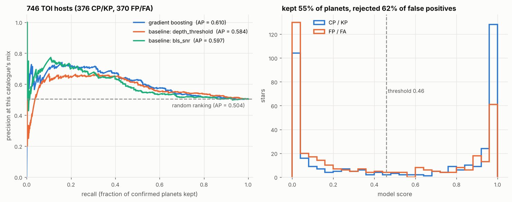

**The model barely separates confirmed planets from TOI false positives.**
The synthetic-trained model beats ranking by BLS signal-to-noise in 74% of
paired bootstrap resamples and the injection-trained one in 66%, and the
fraction of planets kept still rises with depth together with the fraction of
false positives kept: for the injection-trained model, from 0.29 and 0.24
below 1000 ppm to 0.82 and 0.56 at 6000 to 10000 ppm. On this population the
model is mostly a signal-strength ranking, if less so at depth than in the
first run, when those last two were 0.77 and 0.71. The top 20 are 65% real
planets for the synthetic-trained model and 75% for the injection-trained one
(85% and 60% before the occultation change below, 65% and 85% in the first
run). Those swings mean little: over a hundred stars score above 0.99 for the
synthetic-trained model and sixty for the injection-trained one, so which
twenty come first is close to arbitrary. Training on real noise rather than
synthetic noise still makes no difference the intervals can resolve.

**What the first run found, and what was fixed.** The confirmed planets the
model rejected with the most confidence were bright hot Jupiters, read as
binaries:

- **Their transits scatter more than their error bars allow.** The odd/even
  and secondary tests compare groups of transits against white-noise error
  bars. On bright real TOIs the individual transit depths scatter two to
  seven times more than those errors allow, even after a clean detrend: red
  noise, flux errors that understate the real scatter, pulsating hosts, and
  the 30-minute cadence sampling each ingress differently. A third of the
  confirmed planets above TOI SNR 100 read as odd/even binaries, at up to 39
  sigma. Each test is now also scaled by the Birge ratio of its per-event
  depths, sqrt(χ²/dof), when that is larger than β (`depth_scatter_ratio`;
  odd and even events are each compared with their own mean, so a real
  alternation does not count as scatter). The share of those planets over 3
  sigma fell from 36% to 6%, and a binary whose eclipses alternate by 30%
  under the same 5% event scatter still reads above 5 sigma.
- **One transit was erased at a data gap.** TOI 1682.01's 37 sigma came from
  a single missing event that the detrend removed, which is what the masked
  second pass under "Preprocessing" fixes.
- **Their own occultations read as secondary eclipses.** With those two
  fixed, the brightest rejected planets (TOI 1682.01, 2131.01, 1150.01,
  1161.01 and 1599.01) failed the secondary-eclipse test instead. A hot
  Jupiter's dayside goes behind the star at phase 0.5, a dip of 1 to 4% of
  the transit depth on these, which a bright star makes significant.
  Synthetic planets now carry that occultation, from reflected light and
  dayside thermal emission (Cowan & Agol 2011), and the secondary test counts
  only the part of the phase-0.5 dip deeper than the hottest plausible planet
  could make around that star: no heat redistribution, a Bond albedo of zero
  and a geometric albedo of 0.3, on the orbit the period and the star's
  density fix, and never more than 15% of the transit depth
  (`max_occultation_fraction`). Around a Sun-like star that allows 3.5% of
  the transit depth at a one-day period and 0.5% at three days, so a binary's
  secondary still counts nearly in full. The stars' temperatures and densities
  come from TIC v8.2 and are kept in `data/toi_benchmark/tic_stars.csv`. All
  five planets are now kept by both models, as are TOI 1518.01 and 1431.01,
  which the injection-trained model had rejected on secondaries of 6.0 and
  5.2 sigma.

Each change was also run on its own, all trained on synthetic light curves.
Synthetic AP here is repeated 5-fold cross-validation over all 2400 curves,
which is steadier than the 34-planet held-out set. The last column counts the
94 confirmed planets above TOI SNR 100 whose period the search recovered:

| Version | Synthetic CV AP | TOI AP | TOI top 20 | Odd/even over 3σ, planets above TOI SNR 100 |
|---|---|---|---|---|
| Before (#7) | 0.748 ± 0.009 | 0.61 | 0.65 | 36% |
| Event-scatter scaling only | 0.729 ± 0.011 | 0.62 | 0.70 | 6% |
| Masked second pass only | 0.754 ± 0.004 | 0.62 | 0.70 | 33% |
| Both (#15) | 0.744 ± 0.006 | 0.62 | 0.85 | 6% |

The scaling does the odd/even fix. It costs a little on synthetic data, whose
events scatter only as much as their error bars say, and the masked pass wins
that back. On the TOI benchmark all three versions sit inside one another's
intervals: fixing the most confident rejections moved planets across the
threshold, but not enough of them to move average precision on 746 stars.

The occultation change was split the same way. The last column is the same 94
planets, counted as kept at the threshold:

| Version | Synthetic CV AP | TOI AP | TOI top 20 | Planets above TOI SNR 100 kept |
|---|---|---|---|---|
| Before (#15) | 0.744 ± 0.006 | 0.62 | 0.85 | 86 of 94 |
| Synthetic occultations only | 0.749 ± 0.004 | 0.63 | 0.85 | 83 of 94 |
| Per-star allowance only | 0.730 ± 0.006 | 0.61 | 0.60 | 90 of 94 |
| **Both (this version)** | 0.742 ± 0.006 | 0.61 | 0.65 | 90 of 94 |

Training on occultations alone does not keep the five planets: no synthetic
planet's occultation reaches 3 sigma, so the model still reads a 2.4 to 4
sigma secondary as a binary's. The allowance keeps them, and once the synthetic
planets have occultations too it costs nothing on synthetic data. On the TOI
benchmark it forgives about as many false positives as it gains planets: the
injection-trained model now keeps 11 planets and 13 false positives it
rejected before, and the allowance lowered the secondary of 10 of those
planets and all 13 false positives. So average precision stays inside its
interval, as it did for the fixes before. A fixed allowance, a quarter of the
transit depth at a one-day period whatever the star, was tried first and
forgave so many binaries that synthetic CV AP fell to 0.717.

**What still fails.**

- **Shallow secondaries around hot, swollen stars.** Around a hot or
  low-density star at a short period the allowance is large, so a binary's
  shallow secondary there now passes for a planet's occultation. Of the 13
  false positives the injection-trained model newly keeps, 12 orbit stars
  hotter than 6000 K and less dense than 0.8 g/cm³ (the Sun is 5772 K and
  1.41 g/cm³), with secondaries of 1.0 to 3.9 sigma before the allowance. At
  that significance the light curve alone cannot tell the two apart.
- **Two or three transits.** With one odd and one even event, or two and one,
  there are no degrees of freedom left to measure the event scatter, so the
  scaling falls back to β alone. Of the 12 rejected planets whose odd/even
  still reads over 3 sigma, 10 have periods long enough for at most three
  transits in the sector (TOI 1283.01 at 10.3 days reads 10.5 sigma).
- **Blended binaries look like planets in a light curve.** The false positives
  the model keeps have median odd/even and secondary significances well under
  1 sigma, indistinguishable from the planets'. That is what a background
  eclipsing binary diluted by a brighter neighbour looks like, and it takes
  the pixels to see. The centroid veto below removes a quarter of them.

**Pixels: the centroid veto.** A binary on a neighbouring star dims the
pixels where that star is, not where the target is. `--benchmark-centroids`
downloads each scored host's TESS-SPOC target pixel file for its benchmark
sector (about 1 MB a star, cached in `toi_tpfs/` beside the curves) and runs
the difference-image test from "Centroid test" below on the period, epoch and
duration the search found. A star is flagged when the dip in the difference
image sits at least 3 sigma and at least half a pixel (10.5 arcsec) from the
catalogue position. The veto moves every flagged star below every unflagged
one and leaves the order otherwise alone, so the model is the same and the
comparison is paired. All 746 hosts have a pixel file; for 147 the dip is too
weak in the difference image to place (SNR under 3), and those are never
flagged.

The false positives are sorted by the comment ExoFOP gives for each
(`data/toi_benchmark/toi_comments.csv`, downloaded 2026-10-07). The sort is a
keyword match in `false_positive_reason`, and coarse, since the comments are
written for observers:

| Scored hosts | Flagged by the centroid test |
|---|---|
| Confirmed planets (CP/KP) | 6 of 376 (1.6%) |
| False positives placed on another star (NEB, BEB, NPC, a centroid offset) | 42 of 142 (30%) |
| False positives that are binaries on the target (EB, SB, a secondary, V shape) | 12 of 98 (12%) |
| False positives with no reason given | 22 of 103 (21%) |
| False alarms (FA) | 2 of 27 (7%) |

| Model trained on | AP alone | AP with the veto | Gain (68% interval) | Planets kept | False positives rejected |
|---|---|---|---|---|---|
| Injections into real sector 14 noise | 0.61 [0.58, 0.64] | 0.66 [0.64, 0.69] | +0.055 [+0.045, +0.065] | 0.56 to 0.55 | 0.63 to 0.72 |
| Synthetic light curves | 0.61 [0.59, 0.64] | **0.68** [0.65, 0.71] | +0.068 [+0.054, +0.081] | 0.57 to 0.56 | 0.58 to 0.69 |

**The pixels add what the light curves could not.** The veto raises average
precision for both models in every paired bootstrap resample, by far more than
any of the light-curve fixes above, none of which moved it by more than 0.02.
At the frozen threshold it costs 4 or 5 of the 210 to 215 planets each model
keeps and removes a quarter of the false positives each keeps: 41 of 157 for
the synthetic-trained model, 34 of 137 for the injection-trained one. It flags
30% of the false positives that follow-up placed on another star, the class it
is built for. The rest of that class passes for reasons one sector of pixels
cannot fix: for 43 of the 142 the dip is too weak in the difference image to
place, 30 sit more than half a pixel away but under 3 sigma, and 27 measure
within half a pixel, where on-target dips land too (TOI 1310.01's source, for
one, is a star in the same pixel). The test also flags 12% of the binaries on
the target, which should not move the centroid. Some of their comments point
elsewhere as well, to a depth that changes with the aperture (TOI 1509.01 and
1867.01, the latter "offset in recent SPOC data") or a crowded field (TOI
2062.01), so part of that is the sort.

**The floor was set on other stars.** At the 0.1-pixel floor that suits the
synthetic stamps, the test flags 12.5% of the confirmed planets here, which is
how the problem showed up: on real pixels, for about a fifth of the confirmed
planets the difference image can place, the dip's centroid lands 0.1 to 0.5
pixel from the catalogue position, further than its bootstrap error allows (an
undersampled, asymmetric PRF, and catalogue and WCS errors). The floor was
then chosen on the TOI hosts of sectors 1 to 13, in the southern ecliptic
hemisphere, which share no star with this benchmark, using each TOI's
catalogue ephemeris. Of the 458 confirmed planets there with pixel files, 86
showed a significant offset with no floor, 71 of them between 0.1 and 0.5
pixel. Half a pixel left 8 (1.7%) while still flagging 28% of the false
positives, and was frozen before this run. On the search's own ephemeris the
two sets agree:

| Offset floor | Planets flagged, sectors 1 to 13 | False positives flagged, 1 to 13 | Planets flagged, 14 to 26 | False positives flagged, 14 to 26 |
|---|---|---|---|---|
| 0.1 pixel | 17.0% | 30.5% | 12.5% | 26.8% |
| 0.25 pixel | 7.2% | 25.6% | 3.5% | 23.2% |
| **0.5 pixel** | 2.2% | 22.2% | 1.6% | 21.1% |
| 1 pixel | 1.1% | 17.1% | 1.3% | 15.7% |

The whole benchmark on sectors 1 to 13 gives the same result, though it is
not independent of the floor, since it holds the planets the floor was set
on: 845 hosts with curves and pixel files (458 planets, 387 false positives,
chance AP 0.54), synthetic-trained AP 0.72 [0.70, 0.74] alone and 0.77
[0.75, 0.79] with the veto, a gain of +0.053 [+0.043, +0.063]. Report:
[`results/toi_sectors_01_13/toi_benchmark.txt`](results/toi_sectors_01_13/toi_benchmark.txt).

The search is the other ceiling: BLS recovers the catalogued period for 73% of
planets in one sector (88% above TOI SNR 40, 32% below 10), and when it
misses the period the planet is kept 4 to 7% of the time. Searching each
host's sectors 14 to 26 together finds it for 86% (see "Every sector of a
star, searched together").

To reproduce (downloads about 750 curves the first time and caches them to
`toi_curves.npz` beside the results, and with `--benchmark-centroids` as many
target pixel files, 0.8 GB, to `toi_tpfs/`; the hosts' TIC values are read
from `data/toi_benchmark/tic_stars.csv`, and only stars missing from it are
looked up at MAST):

```bash
python run_pipeline.py --inject-into data/real_injection/targets_s0014.txt \
    --exclude-tois data/real_injection/toi.csv --sector 14 \
    --benchmark-tois data/toi_benchmark/exofop_toi_2026-10-06.csv --benchmark-sectors 14-26 \
    --benchmark-centroids
```

The same flags work after the synthetic run (drop `--inject-into` and
`--exclude-tois`), and `--benchmark-sectors 1-13 --results-dir
results/toi_sectors_01_13` runs the replication. A fresh table comes from
`https://exofop.ipac.caltech.edu/tess/download_toi.php?output=csv`; it
carries the comments too, so `--benchmark-comments` can point at it.

### Training on TOI dispositions

Every model above learns from labels known by construction, so the benchmark
asks it to recognise real planets and real false positives it has only seen
simulated. The TOI table holds real labels too, and `--train-sectors` trains
the same classifier on them: the labelled TOI hosts of one set of sectors,
searched and featurised exactly as the benchmark's are, with the same 23
features and hyperparameters. The benchmark then scores it, unchanged, on the
hosts of other sectors, after removing every star it was trained on (code in
`transitml/toi_training.py`). TESS's first year (sectors 1 to 13, the
southern ecliptic hemisphere) and its second (14 to 26, the northern) share no
star, so each trains a model for the other: 857 hosts with curves in the first
(459 planets, 398 false positives) and 766 in the second (376 and 390). Those
counts include 12 and 20 stars taken from a later sector of the same year,
because MAST has no TESS-SPOC curve for them in their first. A scored star
keeps its first sector, so the stars scored are the 746 of the benchmark above
in the second year and 845 in the first.

Two things change with the labels. At about half planets, the threshold rule
above (a floor of 0.5 on the lower bound of cross-validated precision) is met
by keeping every star or nearly: all 857 training hosts of sectors 1 to 13,
and with those of 14 to 26 it rejects 12 to 13% of the false positives. So a
model trained on TOIs keeps a star when its calibrated probability of being a
planet, at the training set's mix, is at least one half
(`probability_threshold` in `transitml/model.py`), again set by
cross-validation on the training hosts. And `--pixel-features` gives the
classifier the centroid test as three more features: how many sigma and how
many pixels the dip sits from the target, and the difference-image SNR, left
missing where the test could not place the dip, which the trees treat as
information rather than imputing.

**Result on sectors 14 to 26** (746 hosts, chance AP 0.50; reports in
[`results/toi_trained/`](results/toi_trained/), and in its `later_sectors/`
for the models that also learned from sectors 27 to 102,
[below](#more-labels-from-later-sectors)):

| Model trained on | Inputs | AP | AP with the centroid veto | Planets kept | False positives rejected | Top 20 |
|---|---|---|---|---|---|---|
| Synthetic light curves | light curve | 0.61 [0.59, 0.64] | 0.68 [0.65, 0.71] | 0.57 | 0.58 | 0.65 |
| TOI hosts, sectors 1 to 13 | light curve | 0.75 [0.72, 0.77] | 0.76 [0.74, 0.79] | 0.70 | 0.68 | 0.90 |
| TOI hosts, sectors 1 to 13 | light curve and centroid test | 0.79 [0.77, 0.81] | 0.79 [0.77, 0.81] | 0.73 | 0.70 | 1.00 |
| TOI hosts, sectors 1 to 13 and 27 to 102 | light curve | 0.76 [0.74, 0.78] | 0.78 [0.76, 0.80] | 0.75 | 0.59 | 0.95 |
| TOI hosts, sectors 1 to 13 and 27 to 102 | light curve and centroid test | **0.80** [0.78, 0.82] | 0.80 [0.78, 0.82] | 0.78 | 0.66 | 0.95 |
| Baseline: rank by BLS SNR | | 0.60 [0.57, 0.63] | | | | 0.65 |

Trained on sectors 14 to 26 and scored on the 845 hosts of 1 to 13 instead
(chance AP 0.54; reports in
[`results/toi_trained/sectors_14_26/`](results/toi_trained/sectors_14_26/)):

| Model trained on | Inputs | AP | AP with the centroid veto | Planets kept | False positives rejected | Top 20 |
|---|---|---|---|---|---|---|
| Synthetic light curves | light curve | 0.72 [0.70, 0.74] | 0.77 [0.75, 0.79] | 0.69 | 0.57 | 0.90 |
| TOI hosts, sectors 14 to 26 | light curve | 0.76 [0.74, 0.79] | 0.78 [0.76, 0.81] | 0.71 | 0.67 | 0.80 |
| TOI hosts, sectors 14 to 26 | light curve and centroid test | 0.81 [0.79, 0.83] | 0.81 [0.79, 0.83] | 0.78 | 0.65 | 1.00 |
| TOI hosts, sectors 14 to 102 | light curve | 0.81 [0.80, 0.83] | 0.83 [0.81, 0.85] | 0.78 | 0.55 | 1.00 |
| TOI hosts, sectors 14 to 102 | light curve and centroid test | **0.84** [0.83, 0.86] | 0.84 [0.83, 0.86] | 0.83 | 0.60 | 1.00 |
| Baseline: rank by BLS SNR | | 0.66 [0.63, 0.68] | | | | 0.55 |

The veto's half-pixel floor was chosen on these 845 stars, so its column in
the second table is not independent of them.

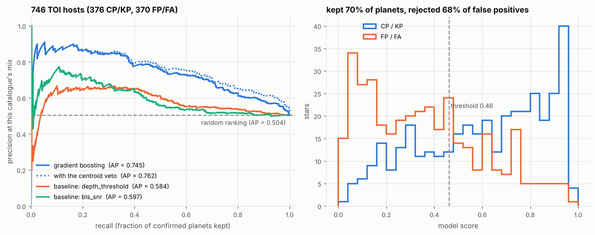

**Real labels do what none of the fixes could.** Trained on the other
hemisphere's dispositions, the same classifier on the same light-curve
features raises average precision on these 746 stars from 0.61 to 0.75, well
outside each other's intervals and further than the centroid veto took the
synthetic-trained model (0.68). It keeps more planets and rejects more false
positives at once, and 18 of its top 20 are planets. With the centroid test as
features it reaches 0.79, and the veto then adds nothing (+0.001): the model
has learned what the veto does, and does it better, since the light-curve
model with the veto reaches 0.76. The other direction agrees, 0.72 to 0.76 to
0.81.

**The gain is in the shallow signals.** Below 1000 ppm the synthetic-trained
model kept 28% of the planets and 23% of the false positives, so it did not
separate them at all; trained on TOIs it keeps 50% and 14%, and with pixels
59% and 14%. Between 1000 and 3000 ppm, where it kept more false positives
than planets (51% against 45%), it now keeps 65% against 33%. Above 6000 ppm
little changes: the synthetic-trained model and both TOI-trained ones keep 82
to 88% of those planets and 46 to 62% of those false positives. Shuffling one
feature at a time across the 746 stars says what the light-curve model leans
on: depth first (it loses 0.08 of average precision without it), then the
period (0.04), the secondary test and the scatter (0.03 each). With pixels
the centroid offset and depth lead, at 0.05 and 0.04.

**Its probabilities carry over.** On the other hemisphere the stars the
light-curve model gives a calibrated P(planet) above 0.8 are 89% planets, and
those below 0.2 are 12%; its Brier score is 0.203, against 0.251 for the
training planet rate alone. The run saves it as
`results/toi_trained/model.joblib`, so `python -m transitml.vet ... --model
results/toi_trained/model.joblib` scores a TOI the way its row of the first
table does. The model with pixel features is not saved, since `vet` computes
light-curve features only.

**What these labels carry.** A resolved TOI is not a random TOI. A planet is
confirmed sooner when it is deep and its star bright, and a false positive is
caught sooner when its source can be resolved, so a model trained on resolved
TOIs learns the follow-up programme's selection along with the astrophysics,
and both halves of this test share that selection, the same pipelines and the
same observers. What these numbers measure is how well the model ranks TOIs
like the resolved ones. Two thirds of the TOI hosts in the table are still
open (5151 of 7826), and the TOIs still open are fainter than the resolved
ones (median TESS magnitude 12.3, against 11.0 for confirmed planets and 10.7
for false positives) and deeper (median depth 5400 ppm, against 4700 and
2800). Depth is the feature this model leans on most, so on them it may do
worse, and nothing here can measure that. The pixel features carry a version
of the same caveat: some false positives were retired because a pipeline's own
centroid test placed them off target.

To reproduce:

```bash
python run_pipeline.py --train-sectors 1-13 --benchmark-centroids --learning-curve \
    --benchmark-tois data/toi_benchmark/exofop_toi_2026-10-06.csv --benchmark-sectors 14-26
python run_pipeline.py --train-sectors 1-13 --pixel-features --learning-curve \
    --benchmark-tois data/toi_benchmark/exofop_toi_2026-10-06.csv --benchmark-sectors 14-26
```

The two runs share one cache in `results/toi_trained/`, which holds the
curves and target pixel files of every host they read (about 2300 of each,
the pixel files 2.8 GB). A run given a `--results-dir` of its own starts a
cache of its own unless `--train-cache` and `--benchmark-cache` both point at
`results/toi_trained/toi_curves.npz`. Swapping the two sector ranges, with
`--results-dir results/toi_trained/sectors_14_26` and those two flags, runs
the other direction.

### More labels, from later sectors

Every model above learned from one year of labels. Whether more would help
can be read off the labels in hand: `--learning-curve` trains the same
classifier on random subsets of the training hosts, ten at each size and each
with their planet rate, and scores every one on the benchmark's stars.
Trained on sectors 1 to 13, the light-curve model's average precision on the
746 stars of 14 to 26 rises by 0.05 from 100 hosts to 200, by 0.03 from 200
to 400 and by 0.02 from 400 to 800 (table below). Each doubling is worth less
than the last, but none of the curves has levelled off.

After its first two years TESS went back over both hemispheres, and the TOI
table holds labelled hosts observed in sectors up to 102. A star never
observed in the benchmark's sectors can train a model for them:
`--train-sectors 1-13,27-102` trains on 1402 hosts instead of 857 and scores
the same 746 stars of 14 to 26, and `--train-sectors 14-102` trains on 1313
instead of 766 and scores the same 845 of 1 to 13. A star observed in any of
the benchmark's sectors is never trained on (779 and 927 are left out this
way), which is what keeps the stars scored the same whichever sectors the
model learned from. In both directions about 545 hosts are added, most of
them from sectors 27 to 55: two thirds are planets, against about half in the
first two years, and they are a magnitude fainter (median TESS magnitude 11.5
to 11.6, against 10.4 to 10.6).

The later sectors needed one change. TESS exposed its full-frame images for 30
minutes in sectors 1 to 26, 10 minutes in 27 to 55 and 200 seconds since, and
some features count cadences (points per transit) or scale with the scatter of
one, so a later sector's light curve and target pixel file are fetched at that
sector's cadence and averaged to 30 minutes (`bin_light_curve` in
`transitml/data/base.py`, `bin_target_pixels` in `transitml/data/tpf.py`).
`tests/test_cadence.py` checks that a 10-minute curve averaged this way gives
the features of a 30-minute one, and on the averaged pixels the centroid test
places these hosts' planets about as close to the target as the first year's
(median offset 0.27 pixels in sectors 27 to 55 and 0.23 from 56 on, against
0.23). A training star with no TESS-SPOC curve in the first of its sectors is
taken from its next one, as within a single year (138 and 148 of them here).

Average precision against the number of training hosts, each value the mean
of ten random subsets (standard deviation 0.01 to 0.04); the last column is
the model in the tables above:

| Trained on (hosts) | Inputs | 100 | 200 | 400 | 800 | All |
|---|---|---|---|---|---|---|
| *Scored on the 746 hosts of sectors 14 to 26* | | | | | | |
| Sectors 1 to 13 (857) | light curve | 0.63 | 0.68 | 0.72 | 0.74 | 0.75 |
| Sectors 1 to 13 and 27 to 102 (1402) | light curve | 0.64 | 0.66 | 0.70 | 0.74 | 0.76 |
| Sectors 1 to 13 (857) | light curve and centroid test | 0.68 | 0.72 | 0.75 | 0.78 | 0.79 |
| Sectors 1 to 13 and 27 to 102 (1402) | light curve and centroid test | 0.68 | 0.70 | 0.74 | 0.78 | 0.80 |
| *Scored on the 845 hosts of sectors 1 to 13* | | | | | | |
| Sectors 14 to 26 (766) | light curve | 0.69 | 0.72 | 0.74 | | 0.76 |
| Sectors 14 to 102 (1313) | light curve | 0.67 | 0.71 | 0.75 | 0.78 | 0.81 |
| Sectors 14 to 26 (766) | light curve and centroid test | 0.75 | 0.76 | 0.79 | | 0.81 |
| Sectors 14 to 102 (1313) | light curve and centroid test | 0.74 | 0.75 | 0.79 | 0.82 | 0.84 |

**More labels help in both directions, by different amounts.** Scored on the
845 stars of sectors 1 to 13, the light-curve model trained on 1313 hosts
instead of 766 rises from 0.76 to 0.81, ahead in all 2000 paired bootstrap
resamples, and ties the model trained on one year with the centroid test
(0.812 against 0.807): there, about 550 more labels are worth what the pixels
are, and with both the model reaches 0.84, ahead of either alone in 1998 of
2000 resamples. Scored on the 746 stars of 14 to 26 the gains are a third as
large, 0.745 to 0.759 for the light-curve model and 0.792 to 0.802 with the
centroid test, each ahead in 84 to 86% of resamples: likely real, and small.
Why the two directions differ this much is not clear from these runs. The
hosts added are alike in both, and at equal training-set sizes the mixed sets
score within 0.03 of a single year's hosts, so a host from a later sector is
worth about what one from the first two years is.

**What the curves say next.** In every row with later sectors more planets are
kept and fewer false positives rejected, because the threshold follows the
training set's planet rate (a calibrated P(planet) of one half at 56 to 58%
planets rather than 49 to 54%), while the ranking itself improved. At their
last step the curves still gain 0.02 to 0.04 of average precision per doubling
of training hosts, so more labels would keep helping. But another doubling
would take more resolved TOI hosts than the whole table holds today (2675
stars), and on one year of labels the centroid features were worth 0.04 to
0.05, about what that doubling would be.

To reproduce, after the runs above (the later sectors add about 650 curves
and 1.1 GB of pixel files to the cache; the first run took about 45 minutes,
most of it searching MAST for stars it has no curve for):

```bash
python run_pipeline.py --train-sectors 1-13,27-102 --benchmark-centroids --learning-curve \
    --benchmark-tois data/toi_benchmark/exofop_toi_2026-10-06.csv --benchmark-sectors 14-26 \
    --train-cache results/toi_trained/toi_curves.npz \
    --benchmark-cache results/toi_trained/toi_curves.npz \
    --results-dir results/toi_trained/later_sectors \
    --figures-dir figures/toi_trained/later_sectors
```

`--pixel-features`, with `later_sectors/pixels` as both directories, gives the
model with the centroid test, and `--train-sectors 14-102 --benchmark-sectors
1-13 --results-dir results/toi_trained/sectors_14_26/later_sectors` the other
direction.

### Every sector of a star, searched together

Every model above searches each star on one sector, and on the TOI hosts that
one sector is often where the signal is lost. BLS finds the catalogued period
(or a low-order alias) for 73% of the 746 hosts of sectors 14 to 26 and 77% of
the 845 of 1 to 13, and where it does not the model ranks the star little
better than chance (average precision 0.56 and 0.53 on those stars, against
0.79 and 0.82 where it finds it). Most of the misses are TOIs with periods
longer than half a sector, or stars observed in many sectors near an ecliptic
pole, where the catalogue found the signal by stacking them. Of the 746 hosts
of sectors 14 to 26, 60% were observed in more than one of those sectors (93
in seven or more); of the 845 of 1 to 13, 39%.

`--stitch` searches every host, training and benchmark alike, on all of the
given sectors it was observed in that have a TESS-SPOC curve, joined by
`stitch_light_curves` (each sector divided by its own median, the gaps kept;
`load_or_fetch_stitched` in `transitml/benchmark.py`). One thing had to change
for that. The BLS grid kept its 2000 trial periods however long the baseline,
and on a year of sectors that lets a transit drift by about a day in phase
between neighbouring trial periods, far more than its own duration. The grid
now grows with the baseline so that the drift stays at what 2000 periods allow
on one sector, 0.05 days (`grid_baseline_days` in `BLSConfig`): a single
sector's grid is unchanged, and a year of sectors gets about 42,000 trial
periods. The centroid test still reads the pixel file of the star's first
sector with a curve (the next section tests every sector's). Features,
classifier and threshold rule are the same.

Average precision on the stars both runs score; the last column is the share
of 2000 paired bootstrap resamples in which joining the sectors scores higher:

| Scored on | Inputs | One sector | Every sector, joined | Ahead in |
|---|---|---|---|---|
| *746 hosts of sectors 14 to 26 (chance 0.504)* | | | | |
| | light curve | 0.745 | 0.776 | 98% |
| | light curve, centroid test as a veto | 0.762 | 0.791 | 97% |
| | light curve and centroid test | 0.792 | 0.804 | 79% |
| | catalogued period found | 73% | 82% | |
| *845 hosts of sectors 1 to 13 (chance 0.542)* | | | | |
| | light curve | 0.764 | 0.796 | 99% |
| | light curve, centroid test as a veto | 0.783 | 0.824 | 99.9% |
| | light curve and centroid test | 0.807 | 0.838 | 98% |
| | catalogued period found | 77% | 82% | |

- **The search finds more of the catalogued signals, where one sector could
  not show them.** 84 and 54 hosts gain their period and 17 and 14 lose it,
  most of those (18 of 31) to a period longer than 15 days, a range one
  sector never offered the search. On stars observed in seven or more
  sectors the share found rises from 53% to 87% and from 43% to 68%; for
  TOIs with periods between half a sector and a whole one (13.7 to 27 days)
  from 45% to 78% and from 38% to 63%, and for longer ones from 6% and 5% to
  about a third. Stars observed in one sector are searched as before (79%
  and 82%).
- **The ranking improves most on the same stars.** On the hosts observed in
  seven or more sectors the light-curve model's average precision rises from
  0.785 to 0.908 (93 hosts of 14 to 26) and from 0.645 to 0.755 (68 of 1 to
  13). Overall it gains about 0.03 in both directions, ahead in 98% and 99%
  of resamples, and the models' own cross-validation on their training hosts
  rises by about as much (0.783 to 0.808, and 0.717 to 0.748).
- **With the centroid test as features the gain is clear in one direction
  only.** Scored on 1 to 13 the model rises from 0.807 to 0.838, ahead in 98%
  of resamples; on 14 to 26 from 0.792 to 0.804, ahead in 79%. There its gain
  on the stars with seven or more sectors (0.77 to 0.92) is partly offset by
  a drop on the 266 with two or three (0.81 to 0.77), which these runs cannot
  tell from noise.
- **A few more stars get a score.** 20 hosts of 14 to 26 and 12 of 1 to 13
  have no curve in their first sector but do in a later one, so all 766 and
  857 are scored: average precision 0.766 and 0.793 for the light-curve model
  (chance 0.491 and 0.536), 0.796 and 0.835 with the centroid test. At the
  frozen threshold the light-curve model keeps more planets (0.77 against
  0.71, and 0.75 against 0.71) and rejects about as many false positives
  (0.66 against 0.68, and 0.68 against 0.67).
- **Where the pixels lag.** For 28 hosts in each direction the first sector
  holds no transit at the ephemeris the joined search found, so their
  centroid test is empty. Testing every sector's pixels closes that gap
  (see the next section).

So joining a star's sectors is worth about 0.03 of average precision in both
directions, less than the 550 later-sector labels added scored on sectors 1
to 13 (0.05) and twice what they added on 14 to 26 (0.014), and most of it
comes from the stars one sector could not show. The labels of later sectors
(27 to 102) are not joined here: their stars span several years, which this
grid would search with hundreds of thousands of trial periods each.

To reproduce, after the runs above (the first run downloads every other
sector of each host, about 2800 more curves, which takes about an hour from
MAST; the search then takes 25 to 40 minutes for each set of hosts on 4
cores):

```bash
python run_pipeline.py --train-sectors 1-13 --benchmark-centroids --stitch \
    --benchmark-tois data/toi_benchmark/exofop_toi_2026-10-06.csv --benchmark-sectors 14-26
```

It writes to `results/toi_trained/stitched/` and shares the curve cache with
the runs above. `--pixel-features` gives the model with the centroid test
(`stitched/pixels/`), and `--train-sectors 14-26 --benchmark-sectors 1-13
--results-dir results/toi_trained/stitched/sectors_14_26` with
`--train-cache` and `--benchmark-cache` set to
`results/toi_trained/toi_curves.npz` the other direction.

### Every sector's pixels, tested together

Joining a star's sectors gave the search more transits, but the centroid
test above still read one pixel file, the first sector's. For 28 hosts in
each direction that sector holds no transit at the joined search's
ephemeris, so their test is empty, and on a star seen in ten sectors it
uses a tenth of the transits the search did. `--centroids-every-sector`
(with `--stitch`) runs the test on the pixel file of every sector a star
was joined from, at the same ephemeris, and combines the tests into one
verdict (`combine_sector_tests` in `transitml/centroid.py`).

The stamps cannot simply be stacked: the spacecraft turns between sectors,
so the same neighbour sits in a different direction in each stamp, and the
cached pixel files keep the target's position but not the sky orientation.
What carries over is how long each sector's offset is and how significant.
The combined significance is Stouffer's: each sector's p-value turned into a
one-sided normal deviate, summed, and divided by the square root of their
number, so an offset seen in every sector adds up while noise in each stays
noise. The length is the mean of the sectors' lengths weighted by the
inverse of their bootstrap variance, and the difference-image SNR adds in
quadrature. A sector enters the offset only when its own test placed the
dip, inside the 3-pixel window it measured over: a flux-weighted centroid of
that window can only land outside it when the difference image there is
noise of both signs rather than a dip. The flag rule is the one for a
single sector (3 sigma, half a pixel), and so are the model and the
threshold rule.

That is the second version. The first combined the p-values by Fisher's
method and kept every sector, and on stars seen in many sectors one wild
sector decided the verdict: a centroid 12 to 24 pixels out from a 3-pixel
window, at 4 to 6 sigma, flagged confirmed planets whose other sectors
showed nothing (10 and 11 planets flagged in the two directions, against 6
and 7 from the first sector alone, and 6 of the 32 planets seen in seven or
more of sectors 1 to 13). Fisher's sum lets the smallest p-value dominate by
design; Stouffer's does not, and that is what "the same offset in every
sector" asks for. The version below was run once, after that change. With
Fisher's method the veto scored 0.791 and 0.827.

On every scored host (the two runs score the same stars, from the same
joined search), with the centroid test from the first sector or from every
sector; the last column is the share of 2000 paired bootstrap resamples in
which every sector scores higher:

| Scored on | Inputs | First sector | Every sector | Ahead in |
|---|---|---|---|---|
| *766 hosts of sectors 14 to 26 (chance 0.491)* | | | | |
| | light curve, centroid test as a veto | 0.781 | 0.793 | 99.9% |
| | light curve and centroid test | 0.796 | 0.802 | 74% |
| | false positives flagged | 86 (22%) | 124 (32%) | |
| | planets flagged | 6 (1.6%) | 9 (2.4%) | |
| *857 hosts of sectors 1 to 13 (chance 0.536)* | | | | |
| | light curve, centroid test as a veto | 0.821 | 0.828 | 82% |
| | light curve and centroid test | 0.835 | 0.836 | 51% |
| | false positives flagged | 94 (24%) | 106 (27%) | |
| | planets flagged | 7 (1.5%) | 7 (1.5%) | |

- **No host is left without a test.** The 28 empty tests in each direction
  are gone; 23 and 17 of those hosts now have their dip placed. In all, the
  test places the dip on 663 of 766 hosts instead of 583, and on 763 of 857
  instead of 737; 8 and 13 hosts have only centroids outside their window.
- **As a veto it rejects more false positives for the same planets.** At
  the frozen threshold the light-curve model with the veto rejects 75% of
  the false positives of sectors 14 to 26 instead of 72%, keeping 75.8% of
  the planets instead of 76.1%; on sectors 1 to 13, 77% instead of 76%, with
  the same 74% of planets. The gain is clear on 14 to 26 and within noise on
  1 to 13. It comes from stars seen in two or more sectors: on the 277
  hosts of 14 to 26 seen in two or three, 46% of the false positives are
  flagged instead of 29%, and the veto's average precision there rises from
  0.753 to 0.784. Stars seen once are tested as before, except that a
  centroid outside its window no longer flags one: that unflags one false
  positive of sectors 1 to 13 (3.3 pixels out) and costs the veto 0.005 on
  the 519 hosts there seen once.
- **As features it is not yet worth more.** The pixel model's own
  cross-validation on its training hosts rises (0.840 to 0.849 trained on
  sectors 1 to 13, 0.775 to 0.793 on 14 to 26), but on the benchmark it moves
  by 0.006 and 0.001, which these runs cannot tell from noise. On the 99
  hosts of 14 to 26 seen in seven or more sectors it rises from 0.849 to
  0.917, and on the 77 of 1 to 13 from 0.757 to 0.768.

So testing every sector's pixels lets the centroid veto flag 124 false
positives instead of 86 in one direction and 106 instead of 94 in the other,
for three more planets flagged in the first and none in the second, and
leaves the model that reads the test as a feature where it was. The
remaining weakness is the geometry: without each file's orientation on the
sky the offsets of different sectors cannot be averaged as vectors, which is
how the TESS data-validation reports combine them and what would let a real
neighbour's offset add up in direction as well as in significance. That
needs the WCS of each pixel file kept in the cache.

To reproduce, after the runs of the section above (the first run downloads
the pixel file of every other sector of each host, about 2800 more files):

```bash
python run_pipeline.py --train-sectors 1-13 --benchmark-centroids --stitch \
    --centroids-every-sector \
    --benchmark-tois data/toi_benchmark/exofop_toi_2026-10-06.csv --benchmark-sectors 14-26
```

It writes to `results/toi_trained/stitched/centroids_every_sector/`, with
`--pixel-features` in `pixels/` below it, and
`--results-dir results/toi_trained/stitched/centroids_every_sector/sectors_14_26`
(with the curve and pixel caches set as above) for the other direction.

---

## Preprocessing: the part that decides whether anything else matters

This is the crux, and it is where most of the engineering went. A detrender that
quietly eats 40% of the transit depth still produces a plausible-looking
pipeline with a quietly worse answer.

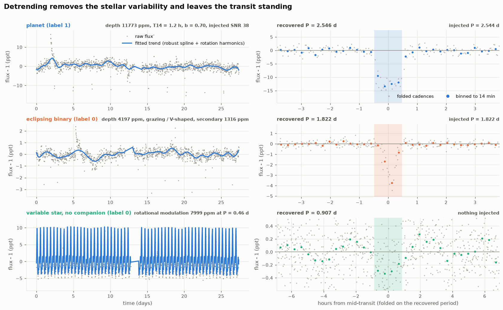

The trend model is **one robust fit**:

```
trend(t) = cubic B-spline(t) + Fourier terms at the star's rotation period
```

fitted by iteratively reweighted least squares with a Tukey biweight loss, and
subtracted. The spline handles slow, non-periodic drift; the Fourier terms
handle coherent variability too fast for a safe spline to follow. They are
fitted *together*, in one design matrix, so there is no question about which
stage gets to claim which signal.

### Why not a running median

A running median is the obvious choice, and it is wrong in a way that is easy
to miss. **The median of a window over a monotone series is that window's centre
value — exactly.** On a star varying fast enough that its trend moves by more
than the photometric noise across one window, the running median therefore
reproduces the data, noise and transit included, and removing it removes the
transit.

This is not hypothetical: it is what the first version of this module did. On a
0.8% variable carrying a 3000 ppm transit, a 0.75 d running median recovers
**41%** of the injected depth. The robust spline fit recovers **101%** — unbiased
to within the measurement's own ~2% noise. Both numbers are asserted in
`test_running_median_eats_the_transit_on_a_steep_star`, which also asserts the
mechanism directly — on steep stretches the median residual is *identically
zero*.

The robust fit has no such failure mode because it never tries to pass through
the data. The transit becomes a cluster of large, one-sided residuals, the
biweight drives their weights to zero, and the trend ends up fitted to
out-of-transit cadences only. This is the "mask the transit, then fit the
baseline" recipe that Kepler and TESS pipelines apply explicitly — here the mask
is discovered rather than supplied.
`test_robust_fit_ignores_the_transit_by_zero_weighting_it` asserts that
in-transit cadences end with weight < 0.05 while out-of-transit cadences keep
weight > 0.8.

### Why the knot spacing has a floor

That protection only works while the transit *is* an outlier. Give the spline
knots tight enough to bend into a three-hour dip and the first, unweighted
iteration fits the transit; its residuals come out small; the biweight sees
nothing to reject; IRLS converges to the wrong answer. At 0.75 d knots and a
0.26 d maximum transit duration, no basis function is narrow enough to absorb
the event. `test_knot_spacing_that_is_too_tight_destroys_the_transit` sets the
knots to 0.05 d and asserts that less than 70% of the depth survives.

That floor is also why the Fourier terms exist: no safe knot spacing can follow
a 12-hour rotator, so fast rotation gets a parametric model instead. Its period
comes from a Lomb-Scargle peak — computed on *winsorised* residuals, because a
deep transit is itself a periodic signal and will otherwise define the peak of
an otherwise quiet star — and its harmonic aliases are resolved by BIC at
matched bandwidth. A spotted star is not a sinusoid: with two spot groups on
opposite hemispheres the tallest periodogram peak sits at *half* the rotation
period, and modelling the star there leaves the fundamental standing for the
transit search to lock onto. The rotation term is kept only if it shrinks the
robust residual scale by at least 5%, which is what stops a quiet star from
being given a spurious rotation model aimed at its planet.

### Clipping is upward only

Flares and cosmic rays are positive excursions; transits are negative ones. A
symmetric sigma clip — the default in most tutorials — deletes exactly the
cadences the search depends on, and deletes them hardest for the deepest, most
detectable transits. `test_clipping_is_upward_only` injects three 2% flares and
asserts that every in-transit cadence survives and the depth is still recovered
to 6%.

**Result:** injected depth is preserved to within 5% across a grid of
variability amplitudes from 0 to 0.8% and periods from 0.5 to 20 days — 20
parametrised test cases — and the detrended scatter comes back at the injected
white-noise floor.

### A second pass, with the transits masked

The discovered mask has one blind spot, and real TESS data found it. At the
edge of a segment (either side of a data gap, or the ends of the sector) the
spline's end basis function lives on the last knot interval only, so it is free
enough to bend into a deep transit on the first, unweighted iteration, exactly
as over-tight knots would. The baseline cadences between the transit and the
gap then sit above the bent trend, the upward clip removes them, and the refit
erases the event. In sector 19, TOI 1682.01 (a known planet, TOI SNR 592) lost
one of its eight 8000 ppm transits this way: the event ends 0.1 d before the
mid-sector gap, the detrended curve shows no dip there at all, and that one
missing event made the odd/even test read 37 sigma.

So every light curve is now detrended twice (`flatten_masked` in
`transitml/features.py`). The first pass is the blind fit above. BLS then finds
the strongest signal, and the second pass keeps every cadence within one BLS
duration of its transits out of the fit altogether (`flatten(..., exclude=...)`),
so the trend is interpolated across the events instead of fitted to them.
Three guards keep the mask from doing harm. Only a signal the search believes
in is masked: the first-pass peak must reach a `bls_sde` of 5.5, the
multi-planet search's threshold. Masking a noise peak protects nothing and
feeds on itself, because with the fit no longer allowed to follow those
cadences the same peak comes back stronger; without this gate the share of
plain variable stars clearing 5.5 on the synthetic run doubled, from 3.7% to
7.8%. There is no second pass when the mask would cover more than 25% of the
cadences (a long box at a short period is not a transit worth protecting). And
a spline basis function that would keep less than 5% of its weight outside the
mask gets its cadences back, so the trend is never an unconstrained
extrapolation. The classifier, the TOI benchmark, `vet` and the example figure
all use the second pass.
`test_a_transit_against_a_gap_is_erased_unless_it_is_masked` rebuilds the TOI
1682.01 geometry: the blind fit keeps 7% of the edge event's depth and clips 12
baseline cadences beside it; the masked fit keeps 97% and clips none.

---

## Features and model

`transitml/features.py` runs a Box Least Squares periodogram (astropy) over a
log-spaced grid of 2000 periods from 0.5 d to half the baseline (more when the
baseline is longer than one sector), and turns the result into 23 features in
four groups:

- **Detection strength** — `bls_sde` (robust periodogram peak significance),
  `bls_depth_snr`, `bls_depth_over_scatter`, `delta_loglike`, `power_contrast`
  (peak power over the best power at an unrelated period).
- **Geometry / physical plausibility** — `log_depth`, `bls_duration`,
  `duration_over_period`, and `log_duration_ratio`: the measured duration
  against the longest duration Kepler's third law permits at that period for a
  solar-density star. An event much longer than that cannot be a planet transit,
  whatever its depth. This is the same fitted-stellar-density consistency check
  real vetting pipelines apply.
- **False-positive discriminants** — `odd_even_sigma`, `secondary_sigma`,
  `half_period_depth_ratio`, `flat_bottom_fraction` (a trapezoid fit's T23/T14,
  ~0.8 for a box and ~0 for a V), `harmonic_delta_loglike`.
  The two significances are divided by the red-noise β (below, floored at 1)
  measured with both the primary and the phase-0.5 windows masked, or by how
  much more the individual events scatter than their error bars allow,
  whichever is larger, so they are judged against the empirical noise on the
  transit timescale rather than white-noise error bars (the TOI benchmark above
  shows why the event scatter matters). `secondary_sigma` also counts only the
  part of the phase-0.5 dip deeper than the planet's own occultation could be
  around its star.
- **Noise characterisation** — `red_noise_beta` (the Pont, Zucker & Queloz 2006
  beta factor: binned scatter over the white-noise expectation, so β ≫ 1 means
  the light curve has structure on exactly the timescale a transit lives on and
  the nominal depth SNR is overstated by that factor), `log_scatter`,
  `max_single_event_fraction`, `flux_skew`, `clipped_fraction`.

The classifier is `HistGradientBoostingClassifier` with shallow trees, strong
L2, `class_weight="balanced"`, and NaN handled natively — a missing odd/even
test means "too few transits to run the test", which is information, not
something to impute away.

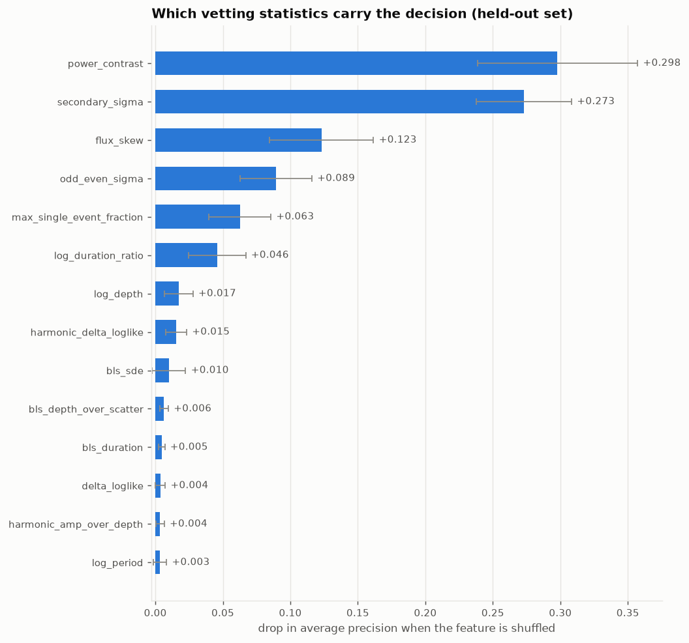

Permutation importance is measured in **average precision**, not accuracy, for
the same reason the headline metric is: permuting a feature barely moves
accuracy at a 4% positive rate, so an accuracy-scored importance plot would be
flat and uninformative.

### Calibrated probabilities and SHAP reasons

The score ranks stars well but is not a probability. With
`class_weight="balanced"` the trees are trained as if planets were as common
as everything else, so a score of 0.5 does not mean half such stars are
planets. `transitml/calibration.py` fits Platt scaling, one logistic map
`P(planet) = 1 / (1 + exp(-(a s + b)))` on the trees' log-odds `s`, to the
same out-of-fold training scores the threshold is chosen from. Here
`a = 0.587, b = -1.220`. The map is strictly increasing, so the ranking,
average precision, the threshold and every verdict are unchanged (the
regenerated `results/metrics.json` matches the previous run on all of them);
only the number attached to each star moves. The operating threshold
becomes P(planet) = 0.118. Isotonic regression was not used: with 62
training planets it is a staircase of a few steps, each set by two or three
stars.

On the 840 held-out stars:

| Probability | Brier | Log loss | ECE |
|---|---|---|---|
| Constant training planet rate (3.97%) | 0.0388 | 0.1695 | 0.0007 |
| Score read as a probability | 0.0191 | 0.0874 | 0.0237 |
| **Calibrated** | **0.0168** | **0.0766** | 0.0139 |

Brier and log loss reward calibration and separation together, so they lead;
expected calibration error on its own would crown the constant forecast,
which is perfectly calibrated and tells you nothing about any star.
Calibration cuts the log loss and the Brier score by 12% each against the
raw score.

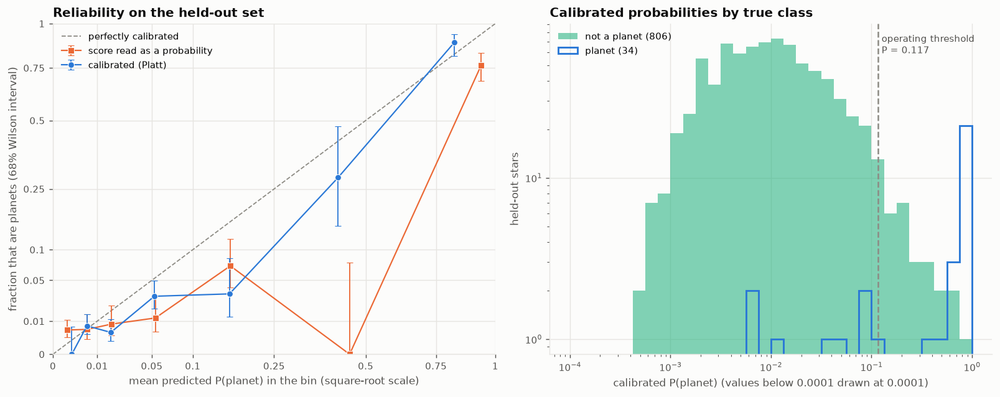

**The calibrated probabilities are a little too cautious.** They expect 37.1
planets in the test set, which holds 34, within one standard deviation of
the binomial scatter (4.5). The excess sits between P = 0.03 and 0.3, where
150 stars expect 10.6 planets and hold 6, while the 49 flagged stars expect
24.1 and hold 26, and 17 of the 19 stars above P = 0.6 are planets. A
logistic fit of the outcome on the calibrated log-odds gives slope 1.11 and
intercept +0.07 (1 and 0 ideal): the many unlikely stars get slightly too
much probability and the few likely ones slightly too little. Two things
push this way: the map is fitted to the scores of fold models trained on 80%
of the training split and applied to the model refit on all of it, and 62
planets set it.

The probability is for a star drawn from the training population, where 4%
of stars host a detectable planet. For any other population Bayes' rule
shifts the log-odds by `logit(rate) - logit(0.0397)`; `vet --planet-rate`
does that.

**SHAP reasons.** `transitml/treeshap.py` computes exact SHAP values from the
fitted trees: per star, one number per feature, in calibrated log-odds, that
add up with a base value (-4.49, P = 0.011) to the star's own log-odds. It is
the quantity path-dependent TreeSHAP computes, written as a closed form per
leaf (a few vectorised lines; trees of depth 3 have at most three features
on a path). `tests/test_treeshap.py` checks it against brute-force
enumeration of every feature subset and against the `shap` package, to
1e-10; `shap` is not a dependency.

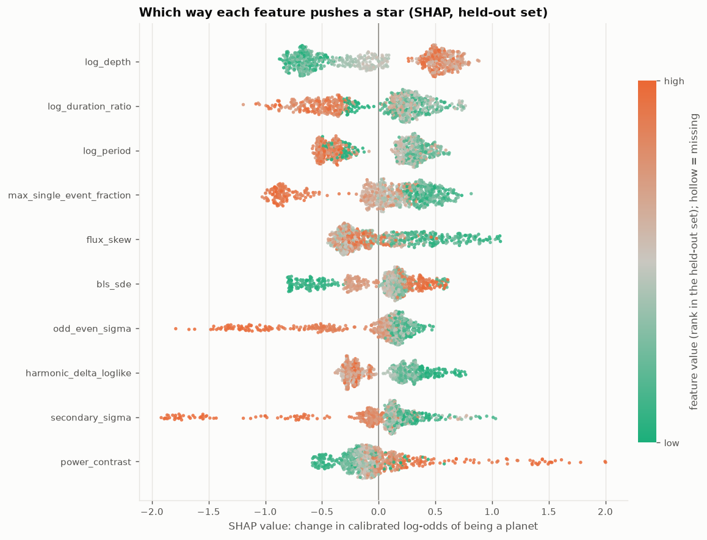

Mean |SHAP| and permutation importance rank the features differently, and
both are right. `log_depth`, `flux_skew`, `harmonic_delta_loglike` and
`max_single_event_fraction` move a typical star by 0.35 to 0.39 in
log-odds, so they lead on mean |SHAP|, but each carries information others
share, so shuffling one costs less average precision. `secondary_sigma` and
`odd_even_sigma` move a typical star by 0.30 and 0.25 and a few by up to
-1.7 and -1.5: those few are the eclipsing binaries. On the 53 held-out
binaries their mean |SHAP| is 0.97 and 0.63, against 0.25 and 0.22 for
everything else, and one or the other is the largest push down for 45 of
the 53. That is why `secondary_sigma` is first in permutation importance:
it is what keeps binaries off the top of the list.

The report lists, for each held-out false positive, the three features that
pushed it up most, and for each planet the classifier rejected, the three
that pushed it down. Of the 23 false positives (15 variable stars, 8
binaries), 11 were pushed up most by `flux_skew`, 5 by
`max_single_event_fraction` and 3 each by `power_contrast` and `log_depth`:
they looked like planets on the shape of their flux distribution, on dips
spread over several events rather than one, on a clean periodogram peak, and
on depth.

### Why not a 1D CNN on folded light curves

The honest answer is sample size. This demo has 96 positives, 62 of them in the
training split. AstroNet (Shallue & Vanderburg 2018) trained on ~15,000
labelled Kepler TCEs; ExoMiner used ~35,000. A convolutional network with 10⁵–10⁶
parameters trained on 62 positives memorises them. Gradient boosting on 23
features is in the right regime for this much data, and the same argument
applies to any real single-sector study.

Two secondary reasons: the sensitivity gain in transit detection comes from
phase-folding N transits together, and BLS already does that optimally for a box
model — a CNN on unfolded curves has to rediscover folding from data, and a CNN
on folded curves needs BLS first anyway. And every feature here maps onto a test
a human vetter or the Kepler Robovetter applies, so when the model says no, the
importances say why.

**The counterpoint stands:** with 10⁵ real light curves, a CNN on global+local
folded views does beat this, because transit *shape* carries information that a
handful of scalars throws away. The choice here is a consequence of the data
volume, not a claim about architectures.

### Kepler DR25: a training set big enough for shape

The data-volume argument above has a way out: Kepler's final data release.
The Kepler pipeline flagged 34,032 threshold-crossing events (TCEs) over 17
quarters, and the DR25 Robovetter sorted every one into a planet candidate
(PC, 4,034), an astrophysical false positive such as an eclipsing binary
(AFP, 3,025), or a non-transiting phenomenon such as instrumental noise
(NTP, 26,973).

```bash
python -m transitml.kepler_dr25                    # 1000 TCEs per class, about 35 min
python -m transitml.kepler_dr25 --all --n-jobs 16  # all 34,032 (about 17,000 stars)
```

This downloads the labels from the NASA Exoplanet Archive (committed as
`data/kepler_dr25/dr25_tce_labels.csv`), fetches every long-cadence quarter of
each star from MAST (no `lightkurve` needed; cached per star), detrends with
all of the star's TCEs masked, and folds each TCE into five views in the
AstroNet format: a 2001-bin **global** view of the whole orbit, a 201-bin
**local** view of the transit, the local view of **odd** and **even** transits
separately, and the local view half an orbit later, where a **secondary**
eclipse would be.

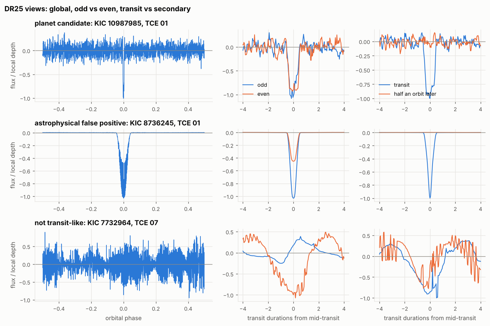

On a class-balanced sample of 3,000 TCEs (2,859 stars, split by star so none
is on both sides), gradient boosting on the binned views, with no Kepler
pipeline statistic as input, scores the 906 held-out TCEs as follows:

| | Views model | Kepler MES alone |
| --- | --- | --- |
| Average precision (chance 0.339) | **0.905** (95% CI 0.878 to 0.930) | 0.312 |
| PC kept, at a threshold frozen on training folds for 90% recall | 88.3% | 87.0% |
| AFP rejected | 79.9% | 7.7% |
| NTP rejected | 95.0% | 33.2% |

MES, the pipeline's detection statistic, ranks below chance: every TCE
already passed it, and the strongest signals are mostly eclipsing binaries
(median MES 73 for AFP against 18 for PC in this sample). At the catalogue's own class mix the same per-class pass rates give
a precision of 64.6% (78.3% on the balanced sample). Full numbers are in
`results/kepler_dr25/report.txt`.

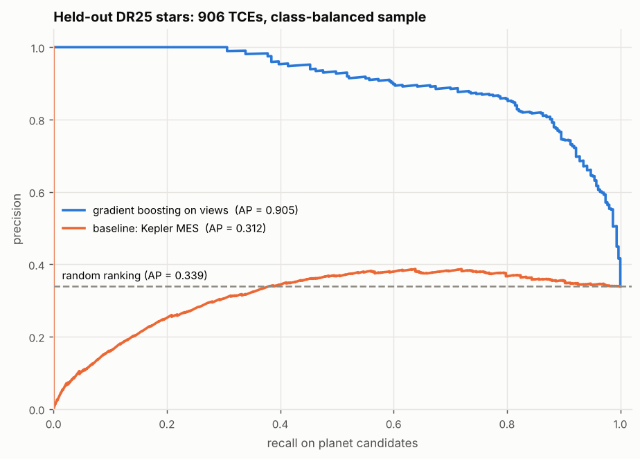

Two caveats. These labels are the Robovetter's calls, so the score measures
agreement with the Robovetter rather than with the truth (it labels
Kepler-10 b, a confirmed planet, as not transit-like). DR24 had a hand-vetted
subset for this; in DR25 that column is empty for every row. And this model
sees binned pixels of shape through a tree ensemble, so it is the baseline a
CNN on the same views has to beat, not the CNN itself.

### A CNN on the same views: a tie at 9,000, ahead at 34,000

`python -m transitml.cnn` trains a two-column network in the AstroNet mould on
those views: four convolution blocks over the global view, two over the local
view with the odd, even and secondary views stacked beside it as channels,
two dense layers, and three networks averaged. PyTorch is an optional install
(`pip install torch`); nothing else needs it, and its tests skip without it.

```bash
python -m transitml.kepler_dr25 --per-class 3025 --no-train \
    --results-dir results/kepler_dr25/large --cache-dir results/kepler_dr25/curves
python -m transitml.cnn --training-set results/kepler_dr25/large/training_set.npz
```

On a larger balanced sample (9,075 TCEs on 7,734 stars: every AFP, and as
many PCs and NTPs), both models score the same 2,720 held-out TCEs:

| Average precision (chance 0.338) | |
| --- | --- |
| CNN, 3 networks averaged | **0.919** |
| Gradient boosting on the same views | 0.915 |
| Rank average of the two | 0.924 |
| Kepler MES alone | 0.316 |

The difference is inside the noise: a paired bootstrap puts CNN minus
boosting between -0.005 and +0.012. At the 90% recall operating point the CNN
rejects more false positives (83.5% of AFPs against 78.4%) but also keeps
fewer planets (88.2% against 91.6%), so the two are trading along the same
curve rather than one beating the other.

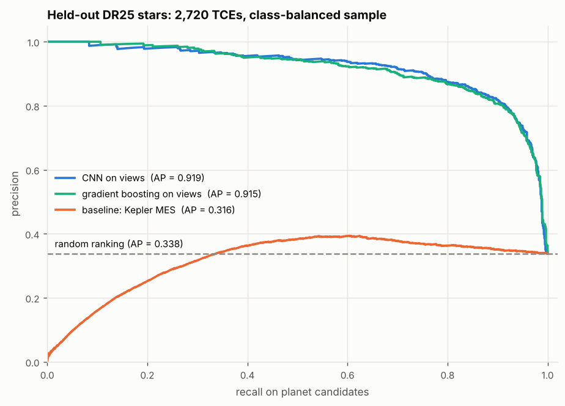

So the sample-size argument was right in both directions. With 9,000 labels a
CNN is no longer starved, and it does match a strong model. But once the
light curve is folded and binned at the right ephemeris, most of the shape
information is already in the bins, and boosting reads it as well as the
convolutions do. Full numbers are in `results/kepler_dr25/cnn/report.txt`.

**On all 34,032 TCEs the CNN pulls ahead.** The same two commands with `--all`
(17,230 stars, about 95 minutes to download and fold, then about 80 minutes
to train both models on four cores) give a test split at the catalogue's own
class mix: 10,243 TCEs on held-out stars, 1,217 of them planet candidates.

```bash
python -m transitml.kepler_dr25 --all --no-train \
    --results-dir results/kepler_dr25/full --cache-dir results/kepler_dr25/curves
python -m transitml.cnn --training-set results/kepler_dr25/full/training_set.npz \
    --results-dir results/kepler_dr25/full_cnn
```

| Average precision (chance 0.119) | |
| --- | --- |
| CNN, 3 networks averaged | **0.910** |
| Gradient boosting on the same views | 0.893 |
| Kepler MES alone | 0.194 |

This time the gap is real: the paired bootstrap puts CNN minus boosting
between +0.009 and +0.026, and the CNN is ahead in every resample. Where it
gains is the false positives. At the 90% recall operating point it rejects
82.4% of AFPs against 75.4% and 99.2% of NTPs against 98.6%, while keeping
87.3% of planet candidates against 89.6%, for a precision of 82.6% against
76.3% at this class mix. The two samples' average precisions cannot be
compared with each other (their chance levels are 0.338 and 0.119), but the
gap between the models can: on 9,075 TCEs it was inside the noise, and with
almost four times the training data it opened to +0.017. That is the
sample-size argument above playing out, the shape model being the one that
keeps learning as labels are added. Full numbers are in
`results/kepler_dr25/full_cnn/report.txt`.

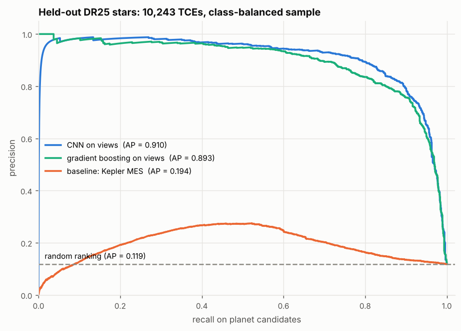

### Kepler labels on TESS: the transfer test

Do 34,000 Kepler labels help vet TESS? `python -m transitml.tess_transfer`
scores the TOI benchmark's hosts (the same sectors 14 to 26 stars as above)
with the DR25 models, unchanged. Each host's one TESS-SPOC sector (30-minute
cadence, close to Kepler's 29.4) is folded into the same five views at every
TOI's catalogue ephemeris, and the star scores as its highest TOI, so which
TOI is scored never depends on the label.

| Average precision on 723 TOI hosts (366 planet hosts, chance 0.506) | All hosts | TESS search found the period (540) |
| --- | --- | --- |
| Kepler DR25 boosting on views | **0.767** | **0.805** |
| Kepler DR25 CNN | 0.761 | 0.798 |
| TESS model trained on synthetic curves | 0.615 | 0.645 |
| TESS model trained on injections into real curves | 0.611 | 0.637 |

The Kepler-trained models are well ahead: CNN minus the better TESS model is
+0.096 to +0.194 in a paired bootstrap. Two things make the comparison less
than equal, and the second column addresses the first. The DR25 models are
handed each TOI's catalogue period and epoch, while the TESS models find their
own with BLS and miss it on a quarter of the hosts; on the 540 hosts where the
search did find it, the gap is the same size. And the catalogue ephemeris
comes from every sector TESS has, so it is sharper than one sector would give.

What does not transfer is the threshold: the CNN's Kepler operating point
(90% recall on Kepler PCs) keeps 68% of TESS planet hosts and rejects 69% of
TESS false positives, so it would need to be set again on TESS labels. Full
numbers are in `results/tess_transfer/report.txt`.

This suggests that real labels, even from another telescope and graded by a robot, teach more
about what a false positive looks like than the synthetic and injected signals
the TESS models were trained on. 23 of the 746 hosts have no TOI with a
complete ephemeris and are left out.

### Kepler first, then TESS: fine-tuning on TOI labels

The transfer test and the model trained on TOI dispositions (above) each beat
the synthetic-trained models from a different side. `python -m
transitml.tess_finetune` asks whether they add up. It folds the labelled TOIs
of sectors 1 to 13 (892 TOIs on 823 stars, 516 of them planets) into the same
views, trains on them, and scores the same 723 hosts of sectors 14 to 26. No
star is in both sets, and every model choice was fixed before the test
sectors were scored.

| Average precision on 723 TOI hosts (chance 0.506) | All hosts | TESS search found the period (540) |
| --- | --- | --- |
| Boosting on views, Kepler TCEs + TESS TOIs | **0.817** | **0.850** |
| Boosting on views, TESS TOIs only | 0.812 | 0.835 |
| Kepler CNN fine-tuned on TESS TOIs | 0.799 | 0.821 |
| Boosting on TOI labels, with pixel features | 0.798 | 0.837 |
| Kepler boosting on views, unchanged | 0.767 | 0.805 |
| Kepler CNN, unchanged | 0.761 | 0.798 |
| CNN on TESS TOIs only | 0.757 | 0.776 |
| Boosting on TOI labels, light-curve features | 0.753 | 0.791 |
| TESS model trained on synthetic curves | 0.615 | 0.645 |

What the paired bootstraps say:

* **Fine-tuning helps the CNN.** Fine-tuned minus unchanged is +0.028 to
  +0.049. Starting from the Kepler weights beats the same network trained on
  TESS alone by +0.009 to +0.076, so 34,000 Kepler labels are worth something
  when there are only 900 TESS ones.
* **For boosting, Kepler adds nothing measurable once TESS labels are in.**
  Adding the Kepler TCEs (weighted so TESS counts as much in total) changes
  AP by +0.005 (-0.016 to +0.026). The fine-tuned CNN does not beat boosting
  on the TESS views either (0.799 against 0.812).
* **The views account for most of the gain over the earlier TOI-trained
  model.** Boosting on the views of the same TOIs beats boosting on the
  pipeline's features by +0.018 to +0.100. Part of that is the catalogue
  ephemeris the views are given, which the pipeline has to find with BLS.
  But the gap holds on the 540 hosts where BLS found the period (0.835
  against 0.791), so the views themselves carry information the summary
  features drop.
* The fine-tuned CNN and the pixel-feature model are level (+0.001, -0.040 to
  +0.050). The views use no pixel data, so the two could still be combined,
  as the next section does for boosting.

At a calibrated probability of 0.5, the fine-tuned CNN keeps 74.9% of planet
hosts and rejects 70.0% of false positives. The caveat from training on TOI
dispositions applies here too. The labels carry the follow-up programme's
selection, so these models rank TOIs that look like the resolved ones. Full
numbers are in `results/tess_finetune/report.txt`.

### Views, the centroid test and every label together

Three results above suggest one model. Boosting on folded views beat
boosting on the pipeline's features when both learned from the same TOI
labels (the fine-tuning test), the centroid test lifted the pipeline's model
by 0.04 to 0.05 as three more features, and the labelled hosts of later
sectors lifted it again ("Training on TOI dispositions" and "More labels,
from later sectors"). `python -m transitml.toi_views` asks whether the three
add up. It folds every labelled TOI on a training star into the five views at
the TOI's catalogue ephemeris, as the fine-tuning test does, and trains the
same boosting model on three sets of inputs, each adding to the last:

* **Views**: the views with log period and duration, the "TESS TOIs only"
  model of the fine-tuning test.
* **+ depth and scatter**: the depth the views were divided by and the
  out-of-transit scatter, both of which the views' common scale takes out.
* **+ centroid test**: the dip's offset from the target in sigma and in
  pixels, and the difference-image SNR, the three features of
  `--pixel-features`, but run at the catalogue ephemeris on the same target
  pixel files.

Stars are chosen as `run_pipeline.py --train-sectors` chooses them: a star
observed in any benchmark sector is never trained on, a training star with no
light curve in its first sector is taken from its next, and a benchmark star
scores as its highest TOI. The pipeline's models are the ones from "More
labels, from later sectors", rescored on the hosts the views can fold (723 of
746 in sectors 14 to 26 and 824 of 845 in 1 to 13, the rest having no TOI
with a complete ephemeris).

| Average precision | 14 to 26, one year | 14 to 26, all labels | 1 to 13, one year | 1 to 13, all labels |
| --- | --- | --- | --- | --- |
| Pipeline features | 0.753 | 0.765 | 0.769 | 0.819 |
| Pipeline features + centroid test | 0.798 | 0.805 | 0.813 | 0.847 |
| Views | 0.827 | 0.835 | 0.839 | 0.859 |
| Views + depth and scatter | **0.842** | 0.843 | 0.839 | 0.862 |
| Views + depth and scatter + centroid test | 0.838 | **0.855** | **0.864** | **0.880** |

Chance is 0.506 on the 723 hosts of sectors 14 to 26 and 0.546 on the 824 of
1 to 13. "One year" trains on the other year's TOI hosts (the view models on
904 TOIs on 835 stars, and on 789 on 743 the other way round); "all labels"
adds the hosts of sectors 27 to 102 (1442 TOIs on 1361 stars, and 1330 on
1271). What the paired bootstraps say (95% intervals):

* **Views beat the pipeline's features in every column**: by +0.074 (+0.033
  to +0.116) and +0.070 (+0.030 to +0.109) with one year of labels, and by
  +0.071 (+0.034 to +0.111) and +0.040 (+0.011 to +0.067) with all of them.
  Trained on one year, the views already score above the pipeline's features
  trained on everything (0.827 against 0.765, and 0.839 against 0.819).
* **With everything in, the views stay ahead of the pipeline's best model.**
  Views, depth and the centroid test against the pipeline's features with the
  centroid test, with one year of labels and then all of them: +0.040 (+0.007
  to +0.077) and +0.049 (+0.014 to +0.087) on 14 to 26, +0.051 (+0.021 to
  +0.082) and +0.033 (+0.006 to +0.061) on 1 to 13.
* **The centroid test adds less to the views than to the pipeline's
  features.** On top of views, depth and scatter it adds +0.025 (+0.005 to
  +0.046) and +0.017 (+0.004 to +0.032) on 1 to 13, +0.012 (-0.005 to
  +0.029) on 14 to 26 with all labels, and nothing there with one year
  (-0.004, -0.023 to +0.016), against 0.03 to 0.045 on the pipeline's
  features. That suggests the views already carry part of what it catches.
* **Depth and scatter add little**: +0.015 (+0.008 to +0.022) on 14 to 26
  with one year, and +0.007, +0.000 and +0.004 in the other columns.
* **More labels still help the full model, by about 0.02**: +0.017 (+0.002
  to +0.033) on 14 to 26 and +0.016 (-0.001 to +0.032) on 1 to 13. On 1 to
  13 the pipeline's features gained more from the same hosts (+0.050, and
  +0.034 with the centroid test), from a lower start.

**Part of the lead is the catalogue ephemeris.** The view models are handed
each TOI's period and epoch from the catalogue, which draws on every sector
TESS has observed, while the pipeline's models search one sector with BLS and
miss the period on a fifth to a quarter of the hosts. On the hosts where the
search found it (540 of 723 and 652 of 824), the full model trained on all
labels leads the pipeline's model with the centroid test by about half as
much, and no longer clear of zero: +0.027 (-0.009 to +0.064) on 14 to 26 and
+0.016 (-0.009 to +0.043) on 1 to 13 (0.865 against 0.839, and 0.901 against
0.886). On light curves alone the views keep a clear lead there on 14 to 26
(+0.062 and +0.064, both intervals above zero) but not on 1 to 13 (+0.035
and +0.023, both crossing zero). So the views carry information the
pipeline's features drop, but about half the lead over the pipeline's best
model goes when the stars BLS missed are left out, and a vetter of a new
star's own BLS candidates would gain less than the table says. The next
section measures how much less.

At a calibrated probability of 0.5, the full model trained on all labels
keeps 90.2% of planet hosts and rejects 60.2% of false-positive hosts on 14
to 26 (89.1% and 62.3% on 1 to 13); trained on one year, 84.7% and 63.3%
(85.8% and 67.6%). As in "More labels, from later sectors", the threshold
follows the training set's planet rate, which the later sectors raise (from
57% to 60% of TOIs, and from 52% to 57%).

Each view model is the mean of five boosting fits with different
early-stopping splits (seeds 0 to 4). A single fit's average precision moved
by about 0.007 with its seed on these stars, as much as some of the
differences above, and the mean was adopted after seeing that; it averages
the seeds rather than choosing one, the same way for every input set, and
the input sets were fixed before any test sector was scored. The views alone
score 0.827 here against 0.812 in the fine-tuning test: the 12 training stars
taken from their next sector account for 0.010 of that and the five-fit mean
for 0.005. The centroid test placed the dip for 77 to 84% of training TOIs
and 76 to 83% of scored ones; for the rest (no pixel file, or a dip too faint
to place in the difference image) its features are missing, and boosting
learns where to send them.

To reproduce, after the runs above (each takes three to five minutes on 4
cores and reads the light curves and pixel files those runs cached):

```bash
python -m transitml.toi_views                          # trained on 1-13, scored on 14-26
python -m transitml.toi_views --train-sectors 1-13,27-102 \
    --compare features results/toi_trained/later_sectors/toi_benchmark.json \
    --compare features_pixels results/toi_trained/later_sectors/pixels/toi_benchmark.json \
    --compare-run one_year results/toi_views --results-dir results/toi_views/later_sectors
```

`--train-sectors 14-26 --test-sectors 1-13` (then `14-102`), with the models
in `results/toi_trained/sectors_14_26` to compare and `--results-dir
results/toi_views/sectors_14_26`, gives the other direction. Full numbers are
in `results/toi_views/`.

### Views at the pipeline's own BLS period

The views above are folded at each TOI's catalogue ephemeris, which a vetter
of a new star does not have. `python -m transitml.bls_views` folds every TOI
host instead at the ephemeris the pipeline's own search found on it, the BLS
peak its 23 features and its centroid test are measured at, and asks the
question again with the ephemeris the same for every input. Each host is
searched exactly as `run_pipeline.py --train-sectors` searches it (a fresh
search reproduces the pipeline's features for all 857 training hosts of the
first run and its BLS period for all 746 benchmark hosts), makes one row
labelled as the pipeline labels it, and is detrended for its views with only
that signal's transits masked. Six input sets go to the same booster as above
(the mean of five fits): the pipeline's 23 features, alone and with the
centroid test, as controls for the booster; then the views, depth and
scatter, and the centroid test, each adding to the last; and finally the
views with everything the pipeline has.

| Average precision | 14 to 26, one year | 14 to 26, all labels | 1 to 13, one year | 1 to 13, all labels |
| --- | --- | --- | --- | --- |
| The pipeline's model | 0.745 | 0.759 | 0.764 | 0.812 |
| The pipeline's model + centroid test | 0.792 | 0.802 | 0.807 | 0.841 |
| Pipeline features, this booster | 0.762 | 0.764 | 0.784 | 0.814 |
| Pipeline features + centroid test, this booster | **0.806** | 0.810 | **0.830** | **0.846** |
| Views | 0.780 | 0.796 | 0.780 | 0.796 |
| Views + depth and scatter | 0.785 | 0.796 | 0.795 | 0.803 |
| Views + depth and scatter + centroid test | 0.790 | 0.818 | 0.823 | 0.831 |
| Views, depth, centroid test and pipeline features | 0.799 | **0.821** | 0.823 | 0.838 |

These are scored on all 746 hosts of sectors 14 to 26 (chance 0.504) and all
845 of 1 to 13 (chance 0.542), the stars of "More labels, from later
sectors"; every host has data near its BLS transit, so none is left out. What
the paired bootstraps say (95% intervals):

* **At the same ephemeris, the views are worth about what the features
  are.** Views against the pipeline's features through the same booster:
  +0.017 (-0.020 to +0.055) and +0.033 (-0.001 to +0.067) on 14 to 26,
  -0.004 (-0.043 to +0.033) and -0.018 (-0.050 to +0.014) on 1 to 13. With
  the centroid test on both sides the views are behind in three columns of
  four (-0.015, +0.007, -0.007 and -0.015), every interval across zero.
* **Adding the views to the pipeline's features does not help.** Views,
  depth, the centroid test and the 23 features against the features with the
  centroid test: -0.006, +0.011, -0.006 and -0.007, every interval across
  zero.
* **The booster accounts for a little.** The same 23 features through the
  five-fit booster score above the pipeline's own model by +0.002 to +0.021
  (+0.005 to +0.022 with the centroid test), clear of zero only on 1 to 13
  with one year of labels.
* **The centroid test adds to the views** +0.022 to +0.028 in three columns
  (intervals above zero) and +0.005 (-0.013 to +0.023) on 14 to 26 with one
  year of labels. Depth and scatter add +0.006 or less, except +0.014 on 1
  to 13 with one year.
* **More labels help the views here too**: +0.017 (+0.001 to +0.032) and
  +0.016 (+0.000 to +0.033) for the views alone, and +0.028 (+0.013 to
  +0.043) and +0.008 (-0.007 to +0.024) with depth and the centroid test.

**So the catalogue ephemeris was most of the views' lead.** On the 723 and
824 hosts both runs scored, the views with depth and the centroid test,
trained on all labels, drop from 0.855 to 0.823 on 14 to 26 and from 0.880 to
0.837 on 1 to 13 when they are folded at the BLS period instead of the
catalogue's (-0.031 and -0.043), and each of the three view models loses
0.03 to 0.06 in every column, all twelve intervals clear of zero. The
catalogue runs differ in two more ways, one row per TOI rather than per host
and every TOI on the star masked when detrending, so not all of that drop is
the period, but none of what the catalogue gave is there when vetting a new
star. For that job the pipeline's own features with the centroid test remain
the best inputs here, and the views add nothing to them. At a calibrated
probability of 0.5 the model with everything, trained on all labels, keeps
81.4% of planet hosts and rejects 62.4% of false-positive hosts on 14 to 26
(83.4% and 62.8% on 1 to 13).

To reproduce, after the runs of "More labels, from later sectors" (each takes
four to five minutes on 4 cores, most of it the search, and reads the light curves and
pixel files those runs cached):

```bash
python -m transitml.bls_views                          # trained on 1-13, scored on 14-26
python -m transitml.bls_views --train-sectors 1-13,27-102 \
    --compare pipeline results/toi_trained/later_sectors/toi_benchmark.json \
    --compare pipeline_pixels results/toi_trained/later_sectors/pixels/toi_benchmark.json \
    --compare-run one_year results/bls_views --results-dir results/bls_views/later_sectors
```

`--train-sectors 14-26 --test-sectors 1-13` (then `14-102`), with the models
in `results/toi_trained/sectors_14_26` to compare and `--results-dir
results/bls_views/sectors_14_26`, gives the other direction. Full numbers are
in `results/bls_views/`.

### Transit Least Squares, and BLS on a GPU

**TLS as the search.** `python run_pipeline.py --search tls` replaces BLS
with Transit Least Squares (Hippke & Heller 2019;
`pip install transitleastsquares`), which fits a limb-darkened transit shape
instead of a box. Everything downstream is unchanged: TLS supplies the period,
duration and epoch, its spectrum stands in for the BLS power in `bls_sde` and
`power_contrast`, and depth and SNR are the same box statistics at TLS's
ephemeris. Results go to `results/tls/`, and the choice is saved with the
model, so `vet` searches the way training did.

On the same 600 synthetic planets, detrended once and searched both ways
(`python -m transitml.search_benchmark`, full report in
[`results/search_comparison/report.txt`](results/search_comparison/report.txt)):

| Injected SNR | Planets | BLS finds the period | TLS finds the period |
| --- | --- | --- | --- |
| below 7 | 91 | 19 | 15 |
| 7 to 10 | 33 | 15 | 17 |
| 10 to 15 | 41 | 29 | 31 |
| 15 to 25 | 77 | 73 | 75 |
| 25 to 50 | 120 | 112 | 115 |
| above 50 | 238 | 237 | 238 |

TLS finds 491 periods against 485 for BLS: 15 planets only TLS finds and 9
only BLS does. That is the direction the TLS paper reports, but a 15 to 9
split is well within chance (p = 0.31, two-sided sign test), and TLS takes
437 ms per light curve against 100 ms. The full pipeline with TLS scores
average precision 0.75 [0.68, 0.82] against 0.74 [0.67, 0.82] with BLS on
the default seed ([`results/tls/report.txt`](results/tls/report.txt)). The
intervals all but coincide, and nothing here says the template is worth four
times the search time on this data, so BLS stays the default.

**BLS on a GPU.** `transitml/fastbls.py` computes the same periodogram as
whole-array operations: every cadence is folded at a block of periods at
once, binned with one `bincount`, and every box of every duration is read off
cumulative sums. It follows astropy's algorithm step for step and matches its
periodogram to 1e-13 on planets, binaries and noise
(`tests/test_fastbls.py`), so the features and the trained model do not
depend on which engine ran. The code runs unchanged on NumPy or CuPy:
`run_pipeline.py --bls-engine gpu` uses a CUDA GPU through CuPy.

**It has not been run on a GPU**, because this environment has none.
`python -m transitml.fastbls --engine gpu` times it against astropy and checks
that the periodograms agree, so the first run on a GPU machine settles whether
it works and how fast it is. On a CPU the array form is about 19 times slower
than astropy (1.9 s against 0.1 s per light curve), because it builds every
box of every period in memory instead of streaming them through a compiled
loop. So astropy stays the default.

---

## Vetting one star

`python -m transitml.vet` scores a single light curve with the model
`run_pipeline.py` saved, and explains the score on one page.

```bash
python run_pipeline.py                                   # writes results/model.joblib
python -m transitml.vet star.csv                         # columns time,flux[,flux_err]
python -m transitml.vet results/real_injection/base_curves.npz --target-id "TIC 123"
python -m transitml.vet "TIC 307210830" --sector 14      # needs lightkurve and network
python -m transitml.vet "TIC 307210830" --stitch         # every sector, joined
```

It detrends and featurises with the preprocessing and BLS settings stored in
the model file, so the score means what it meant in training, then writes
`results/vet/vet_<target>.png` and a JSON of the same numbers: the raw curve
and removed trend, the detrended curve with every candidate signal marked,
the primary fold, odd against even transits, the phase-0.5 window, the key
features with score, threshold, calibrated probability and verdict, and the
top reasons. The reasons are SHAP values in calibrated log-odds (see
"Calibrated probabilities and SHAP reasons" above): exact, and they add up
with the base value to the star's log-odds. The JSON carries all 23. The
probability is for a star from the training population, where 4% of stars
host a planet; `--planet-rate 0.3` restates it for a population where 30%
do. The score and the verdict do not depend on it. `--fit` adds a transit
model fit of the primary signal; see "Fitting a candidate's transit" below.

The secondary-eclipse test discounts the deepest occultation a planet could
show around the host, which needs the star's temperature and density. A MAST
download carries the TIC's values in its header. For a CSV or npz curve, give
them as `--teff 6200 --density 0.8` (kelvin and g/cm³; either one alone
implies the other on the main sequence). Without them the report says the star
is unknown, and the whole secondary counts.

**The TIC path works on real data.** Fifteen known planets were vetted
from their SPOC 2-minute curves (`--author SPOC --exposure-time 120`; the
default is TESS-SPOC 30-minute FFI curves) and a whole sector through the
batch; see "Checked against real planets" and "A real sector" below. A
download takes a few seconds a star. The unit tests still replace MAST with
a stub, so they run offline. The model file is a pickle tied to the scikit-learn
version that wrote it, so it is git-ignored and rebuilt by `run_pipeline.py`;
load only model files you made.

**More than one planet.** The classifier scores only the strongest BLS peak,
and the headline numbers are unchanged. `transitml/search.py` adds an
iterative search for the vetting report: find the best signal, mask 1.5
durations around each of its transits, search again, up to three signals,
stopping at the first peak whose `bls_sde` is below 5.5. On the synthetic run
3.6% of plain variable stars clear 5.5 on their first search, against 61% of
planets. A light curve with nothing significant yields an empty list.

**More than one sector.** `stitch_light_curves` (in `transitml/data/base.py`)
joins sectors of one star: each is divided by its own median, then they are
concatenated with the gaps left as gaps. `MASTLightCurveSource(...,
stitch_sectors=True)` yields one stitched curve per target; the default is
still one curve per sector. Detrending already splits on gaps, so no spline
segment spans one, and the BLS grid extends to half the stitched baseline,
which brings the long-period planets of failure mode 2 below within reach.
The test that pins this uses a 10-day planet with three transits per sector:
neither sector alone gives a significant peak at 10 days, the two stitched
together do. A baseline longer than one sector gets proportionally more
trial periods, so that between neighbouring ones a transit's phase drifts no
further than it does on one sector (about 42,000 periods for a year of
sectors, against 2000); a 40-day planet that transits at most once in any
sector is found in five of them joined.

### Single and duo transits

BLS needs at least two transits, and its period grid stops at half the
baseline, so a planet on a 40-day orbit, which shows one transit in a sector
or none, is excluded by construction (failure mode 2 below). Those are the
long-period, temperate planets, and one event is enough to point a second
sector or a radial-velocity campaign at the star. `transitml/single.py`
searches for individual dips instead, and `vet` runs it on every star:

- **Box scan.** Every cadence is tried as the centre of a box of six
  durations from 1.4 to 11 hours. The depth is measured against the
  cadences one duration wide on either side, so a slow residual trend does
  not read as depth, and its error is the light curve's own scatter binned
  at that duration (red noise inflates it, never below white). A box less
  than 60% observed is skipped, so a dip half in a gap does not count. The
  best box is refined on a finer grid of durations and centres.
- **Events.** The highest-SNR box is an event at SNR 7.5 or more; boxes
  overlapping it are removed and the next is taken, up to four.
- **Ramps are not events.** A momentum-dump ramp, a sharp drop and then an
  exponential recovery, is a lone dip too. Each event is fitted both as a box
  (free centre and width) and as a ramp (free start and time constant, either
  way round in time), and is set aside when the ramp fits better by a
  chi-squared of 4 in noise units. A transit has two sharp edges and a ramp
  one, so the two separate cleanly.
- **What one event says about the period.** Any period that would put
  another transit on observed data without the dip is ruled out (a predicted
  transit whose measured depth is under half the event's), which gives a
  minimum period. It is usually the longer side of the window, but shorter
  when the next transit could hide in a gap. The duration gives a rough
  period for a central transit across a Sun-like density,
  `P = π² G ρ T³ / 3`.
- **Duos.** Two events of matching depth (within 3 sigma plus 20% of the
  depth) and duration (within a factor of 1.6) form a duo. Its period is the separation divided
  by a whole number, and each such alias is kept only if none of the
  transits it predicts lands on flat, observed data.
- **Periodic signals are not repeated.** An event inside a transit of a
  periodic signal from the multi-planet search is dropped, but only when at
  least two of that signal's predicted transits show a dip at SNR 3 or more.
  A BLS "period" whose only real dip is the event itself explains nothing,
  so a true single transit is never hidden behind its own alias.

The report lists each event with its time, depth, duration, SNR, minimum
period and whether it sits next to a gap, marks it with a triangle on the
detrended panel, adds duos with their allowed periods, and names the times
of any ramps it set aside. The JSON carries the same under
`single_events`. **None of it is scored**: the classifier still sees only the
strongest BLS signal, and the headline numbers are unchanged.

```bash
python -m transitml.single_benchmark          # injection-recovery, results/single_transit/
```

**Injection-recovery.** The benchmark puts one long-period planet (P = 14
to 400 d, drawn as in the main population, with its transit moved inside the
sector) into each of 600 synthetic variable stars and leaves 600 others
untouched, then detrends each as `vet` does, masked second pass included.
Full report in
[`results/single_transit/report.txt`](results/single_transit/report.txt).

| SNR against the star's own noise | Planets | Found | Transits up to 10.8 h: found |
| --- | --- | --- | --- |
| below 7 | 227 | 3% | 3% of 195 |
| 7 to 10 | 52 | 50% | 58% of 43 |
| 10 to 15 | 59 | 85% | 94% of 51 |
| 15 to 25 | 65 | 77% | 93% of 45 |
| above 25 | 179 | 94% | 100% of 137 |

- **False alarms.** 14 of the 600 untouched stars (2.3%) show an event, the
  strongest at SNR 13. Before the ramp test it was 97 (16%), most of them
  the generator's instrumental ramps. The test set ramps aside on 87
  stars and lost 8 of the 309 planets found without it.
- **The SNR is the one the search can reach.** It is the transit's mean
  depth over the error of a box of its true duration at its true time, with
  the detrended light curve's scatter and red-noise factor. The white-noise
  SNR of the same transits is twice as high (median), because these stars
  also carry red noise; binned by that, recovery would look far worse than
  the search is.
- **Long transits are the main loss above SNR 10.** The longest box is 10.8
  hours, under the 0.75-day spline knot spacing on purpose (see "Why the
  knot spacing has a floor" above). A longer transit is both longer than
  every box and partly absorbed by the detrender: on a 400-star subset,
  transits longer than 12 hours kept a median third of their depth.
- **Duos.** 66 planets have two transits in the data. Both were found for
  29; 27 of those pair into a duo, and the true period is among the allowed
  aliases for all 27. Without the 20% depth allowance only 20 paired: at
  high SNR the depth errors are smaller than the few per cent that
  detrending and cadence sampling put between two transits of one planet.

### Centroid test: is the dip on the target?

The largest astrophysical false-positive class in real TESS data is a
background eclipsing binary a pixel or two from the target, diluted by the
target's light into a shallow, planet-like dip. The light curve cannot tell
the two apart; the pixels can, because the missing light goes missing from
where its source is. `vet` takes target pixel files for this:

```bash
python -m transitml.vet star.csv --tpf star_tpf.npz               # saved pixels
python -m transitml.vet "TIC 307210830" --sector 14 --centroids   # downloads them
```

`--tpf` reads a file written by `transitml.data.tpf.save_tpf` (plain arrays,
no pickle; repeat the flag for several sectors). `--centroids` downloads the
star's target pixel files through lightkurve with the light curve's author,
cadence and sector. The pixel times must be on the light curve's time system
(BTJD for anything from MAST). On the primary signal's ephemeris,
`transitml/centroid.py` runs two tests, after the Kepler and TESS
data-validation reports:

- **Difference image.** For each transit, the mean image of the cadences
  just before and after it (a quarter-duration gap, then 1.5 durations on
  each side) minus the mean in-transit image, averaged over transits. Its
  flux-weighted centroid is where the dip happens. It is compared with the
  target's catalogue position from the file's WCS, and also reported against
  the out-of-transit centroid. The catalogue position is the reference for
  the flag because the out-of-transit centroid of a crowded stamp is the
  light-weighted mean of every star in it, so an on-target transit sits off
  it too; a test asserts exactly that. Without a catalogue position the
  out-of-transit centroid is used, and that bias applies.
- **Centroid motion.** The flux-weighted centroid of each cadence, in transit
  against the flanking baseline, beside the shift an on-target transit of
  the measured depth would cause. Reported, not used for the flag.

Centroids are measured over the pixels within 3 pixels of the reference, so
noise in far pixels with long lever arms does not dominate. Errors come from
a bootstrap over transits when there are at least 5, or over cadences within
transits when there are fewer (labelled as such, and optimistic when the
noise is correlated). The covariance of a handful of transits is itself
uncertain, so the offset's Mahalanobis distance is referred to Hotelling's
T-squared distribution, `F(2, n - 2)`, with `n` the number of transits or
the Welch-Satterthwaite effective sample size of the cadence bootstrap, and
quoted as a Gaussian-equivalent sigma. Treating the bootstrap covariance as
exact was badly miscalibrated: a nominal 3-sigma offset was reached by 7% of
on-target transits with 9 transits and by 43% with 3. An offset is flagged
when the dip is detected in the difference image (SNR at least 3), the
offset is at least 3 sigma, and it is at least half a pixel (10.5 arcsec;
TESS pixels are 21 arcsec), a floor for what the bootstrap cannot see: an
undersampled, asymmetric real PRF and catalogue and WCS errors. The floor was
set on real pixel files of confirmed planets (see "Pixels: the centroid veto"
under the TOI benchmark); synthetic stamps, with a circular PSF and exact
positions, would do with 0.1 pixel.

On synthetic stamps (`transitml/data/synthetic_tpf.py`: Gaussian stars
integrated over pixels, photon, sky and read noise, 0.005-pixel pointing
jitter), a T = 10 target with a neighbour 2 magnitudes fainter and 1.8
pixels away, 150 scenes each:

| Scenario | Transits | Flagged | Above 2 sigma |
|---|---|---|---|
| Planet on the target | 9 | 0% | 6% (nominal 4.6%) |
| Planet on the target | 1 to 3 | 0 to 0.7% | 4.7 to 5.3% |
| Binary on the neighbour (0.6% dip in the aperture) | 9 | 100% | 100% |
| Binary on the neighbour | 5 | 65% | 100% |
| Binary on the neighbour | 1 to 3 | 81 to 100% | 99 to 100% |

Five transits is the weakest case: the transit bootstrap is in use but an
`F(2, 3)` reference has heavy tails. Pointing jitter is the main nuisance:
at 0.03 pixel per cadence the blend is flagged in 11% of scenes, because a
bright star moving by a fraction of a pixel changes every pixel by more than
a 0.6% dip does. The flux-weighted centroid of an off-centre source is also
pulled towards the window's centre (a neighbour 1.8 pixels away measures at
1.5 to 1.7), so the direction and the significance are what to read and the
length is a lower bound.

That table was measured with a 0.1-pixel floor, and half a pixel changes none
of it: on 150 fresh scenes for each row, every flagged offset, on the
neighbour or not, was at least 0.8 pixel long.

The result goes into the JSON as a `centroid` section (`offset_flag`, one
entry per file with every number above, and a status such as
`no_in_transit_cadences` or `weak_difference_image` when the test cannot
be run or is not meaningful) and into the PNG as a fifth row: the
out-of-transit image with the aperture outlined, the difference image, and
the numbers. A flagged offset is also called out under the title and printed.
**The score is unchanged**: the model was never trained on centroid
features, so the centroid result is a separate vetting test reported beside
it, not folded into it.

**On real pixels.** The conversion, which reads the pipeline aperture
(falling back to lightkurve's threshold mask), the CCD origin, and the target
position from the WCS, has now read about 1,600 real TESS-SPOC target pixel
files, those of the TOI hosts in sectors 1 to 26; on a sample, `--centroids`'
own download returned the same pixels. Real pixels needed the larger floor
above. On them the test flags 1.6% of confirmed planets and a fifth of known
false positives, and as a veto it lifts the TOI benchmark from AP 0.61 to
0.68 (see "Pixels: the centroid veto" under the TOI benchmark). The synthetic
PSF is still a circular Gaussian, much tidier than the TESS PRF. The test
uses only the primary signal and one ephemeris per run, and the model never
sees it: the synthetic evaluation has no pixels, and the benchmark applies it
beside the score. Given several files, `vet` reports each one's test and
flags the star when any of them flags it; the TOI benchmark's
`--centroids-every-sector` combines a star's sectors into one verdict
instead (see "Every sector's pixels, tested together").

## Vetting a whole sector

`python -m transitml.batch` runs every star of a sector through what `vet`
does to one (detrend, search, featurise, score, calibrate, explain) in
parallel, caches each result as it lands, and ranks the lot.

```bash
python run_pipeline.py                                    # writes results/model.joblib
python -m transitml.batch --synthetic 2000                # an offline demo sector, with ground truth
python -m transitml.batch --targets s14.txt --sector 14   # real stars from MAST (one TIC per line, or a CSV)
python -m transitml.batch curves.npz more_curves/         # light-curve files or directories of them
```

It writes four things to `--out-dir` (default `results/batch/<source>/`):

- `candidates.csv`: every star ranked by score, with P(planet), the verdict,
  the primary signal's period, depth, duration and SNR, how many signals the
  iterative search found, and the three SHAP reasons that moved it most.
- `summary.json`: counts, the model file and its fingerprint, how much came
  from the cache, the expected number of planets among the flagged stars
  (the sum of their probabilities), and, when the stars carry ground truth
  (synthetic or injected), how the list scores against it.
- `dashboard.html`: one self-contained page, no network and no server: a
  histogram of P(planet), and a sortable, filterable table with a folded
  light curve per row. Clicking a row shows its SHAP reasons, every signal
  found, and a link to its full report.
- `reports/`: the full one-page `vet` report for the top `--reports`
  flagged stars (10 by default).

`--centroids N` downloads the target pixel files of the N best-ranked
flagged stars (TIC targets; the same pipeline, cadence and sector as their
light curves), runs the centroid test of "Centroid test" below on each
star's own search ephemeris, and adds `centroid_*` columns to
`candidates.csv` (status, whether the dip is off target, the offset in
sigma, pixels and arcseconds, and the difference image's SNR), a count in
`summary.json`, and a centroid panel in the dashboard's row detail. Pixel
files are kept in `cache/tpfs/`, one per star and sector. The score and
the rank are unchanged; an off-target dip is reported beside them.

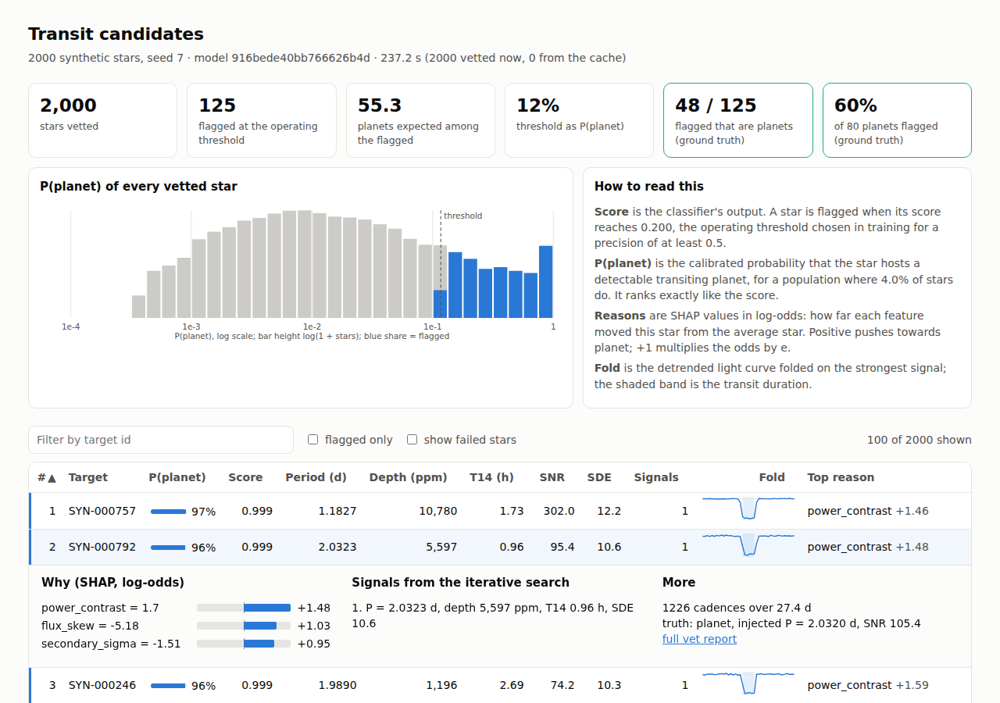

The committed demo is `results/batch/synthetic_seed7/`, from
`python -m transitml.batch --synthetic 2000 --seed 7 --reports 3 --fit 10`:
2000 stars the model has never seen, from the training generator with a
different seed, with transit fits for the ten best-ranked (see "Fitting a
candidate's transit" below). It took 311 s on 4 cores. Without the fits a
sector of the same size takes about 290 s (seeds 8 and 9 below), about 0.6
core-seconds per star.

**Caching.** There are two layers, so a sector can be stopped and resumed
and a rerun does only what changed. Downloaded light curves are saved in
chunks of 200 as they arrive (`curves/`), together with the targets MAST had
nothing for, so an interrupted download restarts where it stopped. Each
star's result is appended to `cache/results.jsonl` the moment it is
computed, keyed by a hash of its light curve, the model file and the search
settings; a rerun skips every star whose key is there. A changed curve
recomputes that star alone, and a new model or new `--max-signals` or
`--min-sde` recomputes everything. A run killed mid-write leaves at most one
torn line, which the next run ignores. `--planet-rate` is applied when the
outputs are written, so restating the probabilities for a population where,
say, 30% of stars host a planet costs nothing. `--force` ignores the cache.
A star whose light curve cannot be processed is reported in the table and
`summary.json` with its error and does not stop the rest.

**How well it does on a fresh sector.** The held-out numbers in the headline
come from 840 stars with 34 planets, a small sample. Three fresh synthetic
sectors of 2000 stars, 80 planets each, scored by the same saved model:

| Sample | Stars | Planets | Flagged | Planets flagged | Precision | Recall | Average precision | Expected planets |
|---|---:|---:|---:|---:|---:|---:|---:|---:|
| Held-out split (seed 42) | 840 | 34 | 49 | 26 | 0.53 | 0.76 | 0.74 | 37.1 |
| Fresh sector, seed 7 | 2000 | 80 | 116 | 49 | 0.42 | 0.61 | 0.62 | 80.0 |
| Fresh sector, seed 8 | 2000 | 80 | 118 | 61 | 0.52 | 0.76 | 0.73 | 86.8 |
| Fresh sector, seed 9 | 2000 | 80 | 97 | 53 | 0.55 | 0.66 | 0.59 | 79.4 |

"Expected planets" is the sum of P(planet) over every star in the sample.
Average precision on the fresh sectors was 0.62, 0.73 and 0.59, against 0.74
on the held-out split: that figure, from 34 planets, sits at the lucky end
of what this model does, and about 0.65 is the better single number. The
threshold was chosen so that out-of-fold training precision was at least 0.5
at one sigma; on fresh stars precision came in at 0.42 to 0.55, 0.49 pooled
over the three sectors, so expect about half of the flagged stars to be
planets. The top 20 were planets in 57 of 60 cases. The probabilities run
slightly high: pooled over the three sectors they add up to 246 planets
where there are 240, about 3% too many, in the same direction as the
held-out 37.1 against 34. The ranking is the dependable part; treat
P(planet) as a slight overstatement.

**Payload.** The dashboard carries every star, but only the flagged stars
and the top 300 by score carry their folded light curve, signals and
reasons in full; the rest carry the table columns and their top reason, and
`candidates.csv` has everything. That keeps a 2000-star sector to 0.8 MB;
a 20,000-star sector flagged at the same rate would be about 7 MB.

**A real sector.** `results/batch/tess_s0014/` is a run on real TESS data:

```bash
python -m transitml.batch --targets data/batch/targets_s0014.txt --sector 14 --fit 10 --centroids 200
python -m transitml.real_check sector results/batch/tess_s0014/candidates.csv \
    --tois data/toi_benchmark/exofop_toi_2026-10-06.csv --sector 14
```

The target list is every star with a sector 14 TOI (782) plus 1,000 drawn
at random from the sector's TESS-SPOC FFI targets that host none. 1,452 of
the 1,782 had a TESS-SPOC 30-minute curve. The other 330 are 327 TOI hosts
with no TESS-SPOC curve for the sector (none of 25 sampled has one; the
pilot's are faint stars covered by QLP and other high-level products), and 3
downloads that failed and worked on a second try. The download took about
20 minutes with 16 workers (1.3 stars a second), vetting 375 s on 4 cores,
and the ten fits about 100 s. Nothing in the pipeline failed. Against the
TOI catalogue (`toi_ranking.txt`):

| group | stars | flagged | search found the TOI period | flagged when it did |
|---|---|---|---|---|
| confirmed or known planet hosts | 130 | 41% | 56% | 71% |
| known false positives | 92 | 40% | 68% | 59% |
| open TOIs | 233 | 21% | 39% | 51% |
| not a TOI | 997 | 5% | | |

Planet hosts against stars that are not TOIs give an average precision of
0.47, against 0.12 by chance; the top 10 are 6 planets, 3 open TOIs and one
false positive, and the top 50 hold 23 planets and 3 non-TOIs. Two things
hold it back, and neither is the batch. Most missed planets are missed by
the search, not the classifier: 59 of the 130 planet hosts have a TOI period
the BLS did not find, with a median period of 16 days (one or two transits
in a 27-day sector, past the grid's half-baseline limit) or a single-sector
SNR too low. And the classifier barely separates real planets from TOI
false positives (average precision 0.65 against 0.59 by chance): those are
the eclipsing binaries and blends that already looked enough like planets
to become TOIs. The ten fits all converged and all ten passed the density
check against the TIC star.

**The centroid test on the sector.** `--centroids 200` covers all 192
flagged stars; their pixel files (221 MB) downloaded in under a minute, and
every one had a file. The test placed the dip for 155 of them:

| group (flagged stars) | tested | dip placed | off target |
|---|---|---|---|
| confirmed or known planet hosts | 53 | 50 | 1 |
| known false positives | 37 | 32 | 11 |
| open TOIs | 49 | 45 | 0 |
| not a TOI | 53 | 28 | 5 |

It puts 11 of the 37 flagged false positives on another star and 1 of the
53 planets. The TOI benchmark flags 1.6% of planets and 22% of false
positives (30% of those the observers placed on another star), so the
batch's rate on false positives is at the high end of that. Used as a veto, ranking off-target dips below the
rest, it lifts the average precision of planets against false positives
from 0.65 to 0.69 (chance 0.59) and leaves planets against non-TOIs at 0.47.
The 5 non-TOI stars it flags are worth a look as blends the TOI process
never caught. The remaining false positives are mostly eclipsing binaries
on the target itself, which pixels cannot separate from planets.

The batch runs the same code as `vet`, star by star, so its scores match
`run_pipeline.py`'s for the same curves (checked to 5e-9 on the 120 test
stars of a small run). A download that raises (a timeout, a corrupt file)
is skipped with a warning naming the star and asked for again on the next
run; a star MAST has nothing for is remembered and not asked for again.

## Fitting a candidate's transit

The classifier says whether a dip looks like a planet. `--fit` says what the
planet would be: it fits a limb-darkened transit model to the primary signal
and samples the posterior, so a candidate comes with a radius ratio, an
impact parameter, a duration and the stellar density its shape needs, each
with an interval.

```bash
python -m transitml.vet star.csv --fit                     # adds a fit to the report
python -m transitml.vet star.csv --fit --stellar-density 1.41 --stellar-radius 1.0
python -m transitml.batch --synthetic 2000 --fit 10        # fits the 10 best-ranked flagged stars
python -m transitml.fit_coverage                           # do the intervals mean what they say?
```

`vet --fit` adds a `fit` section to the JSON, a few printed lines and a
second figure, `vet_<target>_fit.png`. `batch --fit N` fits the N
best-ranked flagged stars and caches each fit in `cache/fits.jsonl`, keyed
by the star's light curve and the fit settings, so a new setting refits and
nothing else does. It adds `fit_*` columns to `candidates.csv` (the median
and half the 68% interval of Rp/R*, b, density, T14, depth and, when the
star's radius is known, the planet radius in Earth radii, then the density
check, convergence and status) and shows the fit in the dashboard's row
detail. The fit sits beside the score and never changes it. A typical fit, 6000 steps of 32 walkers,
takes about 25 seconds on one core, and one that runs to the 30,000-step
cap about five times that. `--fit-max-steps 2000` gives a quick look,
which the report will usually mark as not converged.

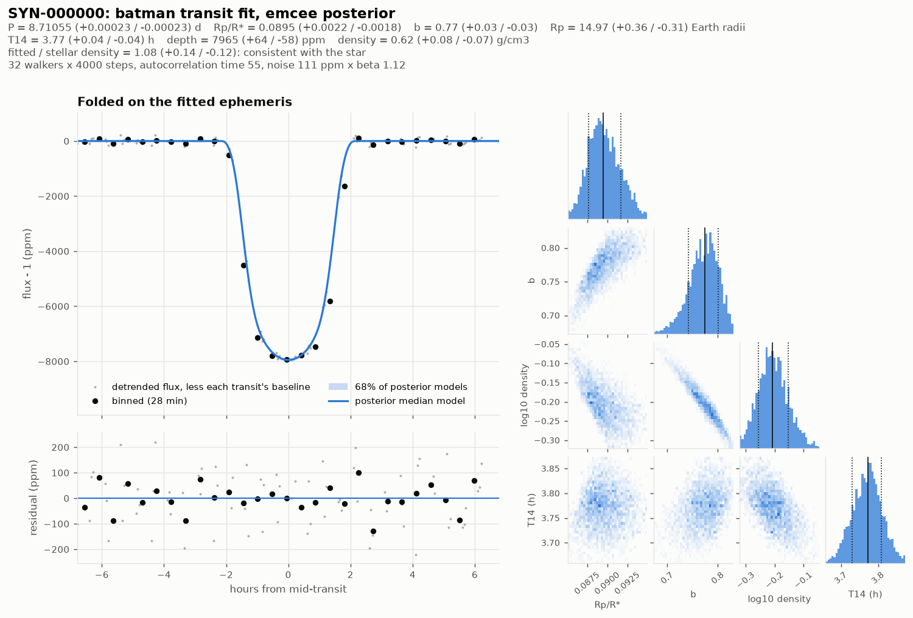

The example is the first planet of the coverage study below, injected into
a variable star and then detrended and searched as `vet` does. The truth
is Rp/R* 0.0906, b 0.80, T14 3.75 h and a density of 0.57 g/cm³; all four
are inside the 68% intervals, and the fitted density is 1.08 (+0.14 / -0.12)
times the star's.

**The model.**

- `batman` (Kreidberg 2015): a circular orbit and quadratic limb darkening,
  integrated over the exposure by averaging the model every 3 minutes
  across it. The exposure is the light curve's cadence by default. Curves
  this package generates (synthetic and injected) are instantaneous, so for
  those it is 0; `--exposure-minutes` overrides both.
- Seven parameters: mid-transit time, period, Rp/R*, b, log T14, and
  Kipping's (2013) q1 and q2. The priors: t0 within one search duration of
  the search's, the period within 2% of it, Rp/R* below 0.5, b up to
  1 + Rp/R* (grazing allowed), q1 and q2 uniform on the unit square, which
  covers every physical quadratic law once, and the stellar density
  log-uniform from 0.01 to 100 g/cm³. The geometry is sampled as T14 rather
  than density: in a shallow transit, b and density slide along a curved
  ridge that a sampler crosses slowly, while T14 is pinned by the data. A
  Jacobian keeps the prior flat in log density.
- Only cadences within 2.5 search durations of each transit are fitted, and
  each transit gets its own quadratic baseline, marginalised
  analytically. The detrended level under a transit is uncertain at the
  level of a transit's depth, and the depth interval should carry that.
- The noise is measured, not taken from `flux_err`: the scatter of the
  cadences outside every fitted window sets the white level, and the
  time-averaging factor β (Winn et al. 2008), how much more binned residuals
  scatter than white noise would on timescales of a quarter to one transit
  duration, inflates it. A star with red noise gets wider intervals.
- `emcee` (Foreman-Mackey et al. 2013) with differential-evolution moves,
  32 walkers started around the best fit. The chain runs at least 4000
  steps, then in blocks of 2000 until it is 50 autocorrelation times long
  after a burn-in of 3, up to 30,000. A fit that stops at the cap says so,
  with `converged: false` and a warning. Fits are seeded, so a rerun is
  identical.
- **The density check** (Seager & Mallen-Ornelas 2003). The star's density
  is not a prior: the fit runs without it and is then compared with it, so
  the comparison is a test. When the density is known (`--stellar-density`,
  the metadata synthetic and injected curves carry, or, for a MAST
  download, the TIC's log g and radius in the file header), the report gives
  the ratio of fitted to stellar density with its interval and flags the
  pair as inconsistent when the two-sided tail probability is below 0.003.
  A density from the TIC is taken with a 30% uncertainty, not 10%: for the
  15 known planets below, the TIC's log g and radius came within 30% of the
  published density (HD 1397, a subgiant, 28% low). A planet transiting
  the target gives a consistent density; an eclipsing
  binary, a blend diluted by another star, or an eccentric orbit often
  does not. A test fits a planet against its own star, which passes, and
  against a star ten times denser, which is flagged.
- Other warnings: a chain that did not converge, a period posterior that
  reaches its prior's edge, a duration close to the width of the fitted
  window, a grazing transit.

**Do the intervals mean what they say?** A 68% interval is only useful if
the truth lands in it about 68% of the time. `python -m transitml.fit_coverage`
injects 60 planets (period 1 to 10 days and Rp/R* 0.04 to 0.12, both
log-uniform, b uniform from 0 to 0.9) into stars from the training
generator and fits each twice: in white noise at the star's level, which
tests the fitter alone, and inside the variable star, detrended and
searched exactly as `vet --fit` does, which tests the whole chain. A planet
is scored only when the search finds its period. The run takes about half an
hour on 4 cores.

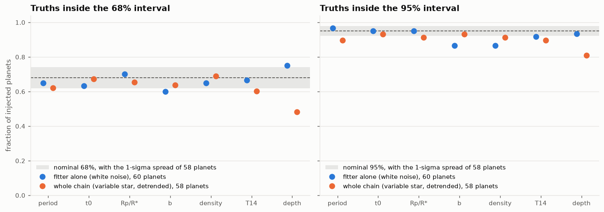

| Parameter | Fitter alone, 68% | Fitter alone, 95% | Whole chain, 68% | Whole chain, 95% |
|---|---:|---:|---:|---:|
| Period | 0.63 | 0.97 | 0.62 | 0.97 |
| t0 | 0.63 | 0.97 | 0.62 | 0.91 |
| Rp/R* | 0.73 | 0.92 | 0.69 | 0.95 |
| b | 0.67 | 0.87 | 0.67 | 0.91 |
| Density | 0.65 | 0.85 | 0.72 | 0.95 |
| T14 | 0.68 | 0.90 | 0.69 | 0.95 |
| Depth | 0.68 | 0.90 | **0.53** | 0.90 |
| Planets scored (converged) | 60 (54) | | 58 (57) | |

Each entry is the fraction of planets whose true value fell inside the
interval. With 60 planets a calibrated 68% interval scatters by about 0.06
and a 95% one by about 0.03.

- **Rp/R\*, T14 and period are calibrated** in both experiments, to within
  that scatter, and so is t0 apart from a whole-chain 95% of 0.91. Rp/R\* is
  the number to read for a candidate's size.
- **b and density, fitter alone: the 95% intervals are a little narrow**,
  0.87 and 0.85. One sector often barely constrains b, and so the density,
  which leaves their intervals leaning on the prior; a credible interval is
  only guaranteed to cover when the truths are drawn from the prior, and
  these planets are not (b uniform up to 0.9, a single limb-darkening law).
  Two of the eight b misses are planets with b near 0, which a central
  interval of a parameter bounded at 0 cannot contain. In the whole chain,
  where the red-noise factor widens every interval, density reaches 0.95 and
  b 0.91.
- **Depth, whole chain: the 68% intervals are too narrow**, 0.53, while
  the 95% intervals hold 0.90 of the truths. Of the six planets outside the
  95% interval, three are off by 2% to 5%, on stars with strong red noise (β
  of 1.1 to 1.3), where detrending leaves a small distortion under the
  transit. In the other three the detrended curve itself is off: measured at
  mid-transit it holds 88%, 96% and 112% of the injected depth, and the fits
  follow it, at 71%, 93% and 119%. Detrending still moves the depth by about
  the width of its interval, which a fit of the detrended curve cannot
  undo. Before the masked second detrend pass, two deep planets on 1.2 and
  1.6 day orbits lost most of their depth to the rotation term, which
  fitted at the planet's period (19% and 39% of the depth was left); the
  masked pass leaves 99% and 93%, and both fits now cover. Rp/R\* is
  calibrated on the same planets because its interval is wider: it trades
  off against b and the limb darkening.
- **Faint transits can wander.** Six chains in white noise and one in the
  whole chain stopped at the 30,000-step cap. Two of the six, on
  transits barely above the noise, drifted into grazing solutions (b above
  1, with Rp/R\* of 0.15 and 0.22 for planets of 0.042 and 0.045), and
  unconverged chains account for three of the six fitter-alone depth
  misses. The report flags such
  fits as not converged and grazing; treat a fit with a warning as a
  rough guide.

**How it got here.** The first version fitted a single flux level instead
of a baseline per transit: 35 of 60 chains converged in each experiment,
and the whole chain's depth coverage was 0.45 and 0.74. A straight line
under each transit brought convergence to 56 and 54 and depth to 0.48 and
0.81; the quadratic, now the default, gave 54 and 56 and 0.50 and 0.86, and
lifts the whole chain's 95% coverage of Rp/R\*, b, density, T14 and period
from 0.90 to 0.93 to between 0.93 and 0.97. It costs intervals about 5%
wider on Rp/R\* and 11% wider on depth. `--baseline` on the coverage
study, and `FitConfig.baseline`, switch between `offset`, `line` and
`quadratic`. All of those numbers were measured on a single, blind detrend;
the masked second pass, which `vet` and the batch now run, then took the
whole chain to 57 converged chains and depth coverage to 0.53 and 0.90.

**Checked against real planets.** Fifteen known TESS planets, fitted from
one sector of SPOC 2-minute photometry each and compared with the NASA
Exoplanet Archive's composite values (`data/real_planets/published.csv`):

```bash
python -m transitml.real_check planets      # writes results/real_planets/comparison.{csv,txt}
```

They span hot Jupiters (WASP-18 b, WASP-62 b, WASP-121 b, WASP-126 b,
HD 2685 b), a warm Saturn round a subgiant (HD 1397 b), Neptunes (HD 219666 b,
TOI-132 b, LTT 9779 b), small planets round M dwarfs (LHS 3844 b, TOI-270 c,
L 98-59 c), pi Men c at 300 ppm, and a grazing one (HIP 65 A b, b = 1.17).
Fitted median against published, and the difference in units of the
combined 1-sigma uncertainty:

| planet | P (d) | Rp/R* | b | T14 (h) | density (g/cm³) |
|---|---|---|---|---|---|
| pi Men c | 6.2676 (+0.5) | 0.0167 / 0.0158 (-1.7) | 0.44 / 0.65 (+0.6) | 3.00 / 2.95 (-1.1) | 1.53 / 0.94 (-0.6) |
| WASP-18 b | 0.94146 (-2.5) | 0.0980 / 0.1018 (+3.3) | 0.41 / 0.36 (-0.4) | 2.19 / 2.21 (+0.8) | 0.86 / 0.80 (-0.6) |
| HD 2685 b | 4.1269 (-0.1) | 0.0948 / 0.0947 (-0.3) | 0.27 / 0.26 (-0.1) | 4.50 / 4.41 (-4.4) | 0.46 / 0.51 (+0.4) |
| LHS 3844 b | **0.9258, twice 0.4629** | 0.0648 / 0.0626 (-0.9) | 0.35 / 0.14 (-0.9) | 0.53 / 0.52 (-0.1) | 55 / 32 (-1.1) |
| HD 219666 b | 6.0358 (-2.1) | 0.0401 / 0.0421 (+1.0) | 0.78 / 0.84 (+0.7) | 2.09 / 2.16 (+0.7) | 1.9 / 1.2 (-0.8) |
| WASP-62 b | 4.4120 (-0.8) | 0.1097 / 0.1111 (+2.2) | 0.13 / 0.23 (+1.0) | 3.78 / 3.82 (+1.4) | 0.93 / 0.85 (-0.7) |
| HD 1397 b | 11.5352 (+0.1) | 0.0450 / 0.0451 (+0.3) | 0.16 / 0.17 (+0.0) | 8.53 / 8.60 (+1.6) | 0.17 / 0.15 (-1.5) |
| WASP-121 b | 1.27493 (-0.4) | 0.1216 / 0.1226 (+2.2) | 0.09 / 0.10 (+0.1) | 2.90 / 2.91 (+0.6) | 0.64 / 0.63 (-0.9) |
| HIP 65 A b | 0.98097 (+0.3) | 0.283 / 0.287 (+0.0) | 1.16 / 1.17 (+0.0) | 0.79 / 0.79 (-0.3) | 2.87 / 2.90 (+0.1) |
| TOI-132 b | 2.1093 (+2.3) | 0.0342 / 0.0356 (+0.8) | 0.41 / 0.53 (+0.4) | 2.06 / 2.13 (+0.4) | 1.8 / 1.9 (+0.3) |
| TOI-270 c | 5.6604 (+0.2) | 0.0593 / 0.0560 (-1.1) | 0.37 / 0.35 (-0.1) | 1.68 / 1.68 (+0.1) | 9.9 / 10.6 (+0.3) |
| L 98-59 c | 3.6906 (+0.7) | 0.0408 / 0.0396 (-0.7) | 0.51 / 0.41 (-0.3) | 1.28 / 1.28 (+0.0) | 11 / 13 (+0.3) |
| WASP-126 b | 3.2886 (+2.8) | 0.0779 / 0.0780 (+0.2) | 0.11 / 0.30 (+0.9) | 3.42 / 3.44 (+0.8) | 0.86 / 0.79 (-0.8) |
| TOI-169 b | 2.2556 (-1.1) | 0.0735 / 0.0866 (+1.4) | 0.76 / 0.92 (+1.6) | 1.58 / 1.71 (+1.2) | 2.2 / 0.76 (-1.4) |
| LTT 9779 b | 0.79204 (+0.6) | 0.0344 / 0.0455 (+3.0) | 0.38 / no value | 0.77 / 0.37 (-5.1) | 13 / 1.8 (-2.4) |

Of the 59 comparisons of radius ratio, impact parameter, duration and
density, 69% fall within one unit, 88% within two and 95% within three,
close to what honest intervals give (68%, 95%, 99.7%), with the caveat
that the composite table mixes papers, so a planet's published numbers can
come from different solutions. Every chain converged, and every planet but
LHS 3844 b scored above the threshold. What the comparison found:

- **LHS 3844 b** (P = 11 hours) was found at twice its period, because the
  search grid starts at 0.5 days. At 2P every other transit sits at phase
  0.5, where it looks like a binary's secondary eclipse, and the score
  drops to 0.05 (the secondary statistic is among the report's top reasons). The fit itself, at 2P, still recovers Rp/R*, b and
  T14.
- **LTT 9779 b**, a shallow 46-minute transit, fitted at the wrong end of
  the radius-ratio and impact-parameter ridge: Rp/R* 0.034 against 0.046
  and a stellar density of 13 against 1.8. The density check flags it
  (against the TIC's 1.4 g/cm³), which is the check doing its job. (The
  archive's T14 for it, 0.37 hours, is shorter than its own period and
  density allow for any non-grazing transit, so that column is not a fair
  test.)
- The other differences beyond two units are small in absolute terms: Rp/R*
  of WASP-18 b, WASP-62 b and WASP-121 b 1% to 4% below the composite value
  (Shporer et al. 2019, from TESS alone, find 0.0972 for WASP-18 b, the
  same as this fit), and
  the duration of HD 2685 b 6 minutes longer while its density agrees.

Before this check, a MAST curve's fit had no density check at all: the fit
looked for a density only in the synthetic curves' metadata, while a MAST
download carries the TIC's log g and radius instead. It now works the
density out from those (see "The density check" above), and all 15 hosts'
TIC densities are within 30% of the published ones.

**Limits.**

- Circular orbits only. An eccentric planet's transit has a different
  duration from a circular one's, so it shows up as a density mismatch.
- One signal is fitted, the primary. Another planet's transits inside the
  fitted windows are not masked.
- The training generator's planets are trapezoids, not limb-darkened
  transits, so fits of them are approximate: the limb darkening absorbs
  part of the mismatch. The coverage study injects `batman` transits for
  this reason.
- Periods under half a day are out of reach: the search grid starts at
  0.5 days and its shortest box is 58 minutes, so an ultra-short-period
  planet is found at twice its period and fitted there (LHS 3844 b above).
- Without the star's density the radius ratio and impact parameter of a
  shallow, short transit trade off along a ridge, and the fit can settle on
  the wrong end of it (LTT 9779 b above). The density check is what catches
  it, so give `--stellar-density` for a curve that does not carry one.

---

## Failure modes

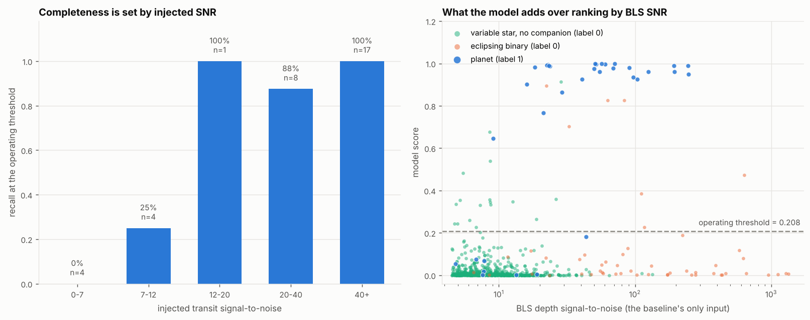

Recall is not one number. A planet is missed either because the **search** never
found its period — no classifier can rescue that — or because the search found
it and the **classifier** rejected it. Those have different fixes, and reporting
only their product hides which one binds:

```
  SNR bin            n   recall   search  classifier
  0 - 7              4     0.00     0.00         n/a
  7 - 12             4     0.25     0.50        0.50
  12 - 20            1     1.00     1.00        1.00
  20 - 40            8     0.88     0.88        1.00
  40 - inf          17     1.00     1.00        1.00
```

Below SNR ~12 the search is the binding constraint and the classifier never gets
a chance. Above SNR ~40 both stages are now perfect on the held-out set. In the
first version they were not: the search found all 17 planets there, but the
classifier rejected two of them (failure mode 4 below), which is what pointed
at the classifier's binary tests as the place to put effort. Of the 8 planets
still missed, 7 are search misses and 1 is a classifier rejection.

**1. Low SNR.** Four test planets have injected SNR below 7; none are recovered,
and none should be. That is not a defect, it is the detection limit, and a
pipeline claiming to recover 5-sigma signals is measuring something other than
the transit.

**2. Long period / too few transits.** `SYN-002073` (P = 9.8 d, 3 transits) and
`SYN-000935` (P = 9.0 d, 3 transits) are both missed at the search stage. With a
27.4-day baseline, a 10-day planet contributes at most three events, the folding
gain is `sqrt(3)`, and the BLS peak is not distinguishable from the alias forest.
Single-transit events are excluded from the periodic search by construction: the
period grid is capped at half the baseline, because a single event cannot be
confirmed as periodic. Real surveys solve this by stacking sectors, not by better
statistics on one: on the real TOI hosts, searching each star's sectors
together finds the catalogued period for 82% of them instead of 73 to 77%
(see "Every sector of a star, searched together"). `vet` now also lists
lone and paired dips from a separate single-event search (see "Single and
duo transits" above), but the classifier and these numbers do not use it.

**3. Grazing, V-shaped transits.** `SYN-001633` (b = 0.94) and `SYN-000250`
(b = 0.92) are both missed. A grazing planet produces exactly the V-shaped,
short, shallow event that `flat_bottom_fraction` and the binary tests are built
to reject. **This is a real cost of the eclipsing-binary discriminants, not a
bug**: the features that let the model beat the SNR baseline by 4.2× are the same
features that throw away grazing planets. Nothing in a single-sector light curve
distinguishes a grazing planet from a grazing binary; that takes radial
velocities.

**4. Red noise faking a binary signature (fixed).** In the first version the
two highest-SNR misses were planets the search found perfectly and the
classifier rejected on binary grounds:

```
SYN-001624  SNR  62  -> period recovered; classifier rejected it
                        (odd/even 3.7 sigma, secondary 2.4 sigma, red-noise beta 1.50)
SYN-001838  SNR 108  -> period recovered; classifier rejected it
                        (odd/even 5.0 sigma, secondary 4.1 sigma, red-noise beta 2.31)
```

Both stars have correlated noise on transit timescales, which produced a
spurious odd/even depth difference and a spurious secondary eclipse measured
against astropy's white-noise error bars. The odd/even and secondary
statistics are now divided by β, floored at 1 (Pont, Zucker & Queloz 2006),
which inflates their error bars to the empirical noise at that timescale.
Their odd/even significances drop to 2.4 and 2.2 sigma and their secondaries
to 1.6 and 1.8 sigma; the model scores them 0.99 and 0.97 and **both are now
recovered**. Held-out average precision rose from 0.730 to 0.799, and the
classifier now keeps every planet the search finds above SNR 12. Eclipsing
binary false positives did not rise (8 before and after).

One detail mattered. The `red_noise_beta` *feature* masks only the exact BLS
box, and with that mask the ingress and egress cadences of a slightly
mis-fitted period or duration leak into the out-of-transit bins; a single
leaked cadence of a deep event dominates the binned scatter. On a pure
white-noise light curve with a 3000 ppm transit it reads β = 1.5 to 2.4, so
scaling by it would have discounted the binary tests of every deep event, real
binaries included. The β used for scaling therefore masks two box-widths
around both the primary and phase 0.5 (the latter so a real secondary eclipse
cannot inflate the β that is then used to discount it), and returns β ≈ 1 on
that same light curve. `tests/test_features.py` asserts both behaviours. The
feature itself was left unchanged, so the β values printed in the report are
the feature's; for these two planets the two estimates agree.

**5. False positives are mostly variable stars, not binaries.** Of 23 false
positives, 8 are eclipsing binaries and 15 are plain variable stars. Per object
that is a **15.1%** false-positive rate on the 53 binaries against **2.0%** on
the 753 variable stars. Binaries are more than seven times as likely to fool the model,
exactly as expected, but residual variability that survives detrending still
dominates the candidate list by sheer weight of numbers. That matches the real
TESS experience, where most rejected candidates are systematics rather than
astrophysical false positives.

---

## What this does and does not prove

**What it establishes.** The pipeline is real and the numbers are real: the
detrender provably preserves transit depth to 5% while removing variability ten
times deeper; the search recovers every held-out injection above SNR 40 and 88%
above SNR 20; the classifier beats a strong single-statistic baseline by 4.2× in
average precision on data it has never seen — in 100% of paired bootstrap
resamples — with the threshold frozen from training-split cross-validation. The evaluation protocol — average precision against the
positive-rate null, threshold from CV, recall decomposed into search and
classifier — is exactly what one would use on real data, and
`tests/test_evaluation.py` asserts that corrupting the training rows changes no
reported number while corrupting the test rows does.

**What it does not establish.** The noise model is the weak point, and it is
weak in the direction that flatters the result. Real TESS systematics are
*structured*: scattered light from the Earth and Moon on a 13.7-day orbital
cycle, focus changes with spacecraft thermal state, pointing jitter correlated
across a whole camera, background contamination from neighbouring stars in a
21-arcsecond pixel. None of that is a stationary 1/f process. My default red
noise is generated as a power law with random phases, star by star, so it has
no features the detrending can fail on in a correlated way across targets, and
a robust spline handles it more easily than it would handle real data.
`--systematics` adds the shared, spacecraft-driven part (see "Structured
systematics in the synthetic sector" above); on paired controls it costs 0.05
to 0.13 in average precision and 4 to 16 of the 96 planets' periods in the
search, mostly through momentum dumps. Its shapes are simple parametric forms
rather than measurements from real sectors, and it still leaves out
contamination from neighbours. I would expect average precision to drop
substantially on real photometry, and the drop to come mostly from the
false-positive side.

Three further gaps:

- **Blends.** The single largest astrophysical false-positive class in real TESS
  data is a background eclipsing binary diluted by a bright foreground star
  inside the same pixel. It looks exactly like a shallow planet transit and is
  separated by *centroid motion*: the flux-weighted centroid shifts during the
  event, which takes pixel-level data to see. The headline classifier still
  sees light curves only. `vet` can run a difference-image
  centroid test from target pixel files beside the score (see "Centroid test"
  above). On real TOIs it flags 30% of the false positives that follow-up
  placed on another star and 1.6% of confirmed planets, and as a veto it
  raises the TOI benchmark's average precision from 0.61 to 0.68; the rest of
  the blends are too faint in the difference image or too close to the
  target for one sector of pixels. A model trained on TOI dispositions with
  the centroid test as three more features reaches 0.79 there, and 0.80 with
  the labels of later sectors too (see "Training on TOI dispositions").
  Boosting on each TOI's folded views with the same test reaches 0.855 on
  the hosts it can fold when it is given the catalogue ephemeris, but folded
  at the period the pipeline's own search found, the views add nothing to
  the pipeline's features (see "Views at the pipeline's own BLS period").
- **Labels.** Ground truth is known by construction here. On real data it has to
  come from a catalogue that inherits the selection function of the pipelines
  being benchmarked against, or from injection-recovery, which only measures
  completeness and not the false-positive rate. The TOI benchmark above does
  the first, and shows the synthetic-trained model separates real planets from
  real TOI false positives only slightly better than a signal-to-noise
  ranking. Trained on the dispositions of other sectors, the same classifier
  does clearly better (0.75 against 0.60 for that ranking, and 0.78 when each
  star's sectors are searched together), but those labels
  carry the follow-up programme's selection, so it is a ranker of TOIs like
  the resolved ones.
- **Sample size.** 96 positives in total and 34 in the test set. The bootstrap
  interval on average precision is [0.671, 0.819], roughly ±0.074, so the
  move from 0.80 to 0.74 between the last two versions of this README is
  noise (cross-validation puts both at 0.74), and only the gap to the
  baselines is meaningful. The pipeline reports the interval so this cannot
  be over-read.

The honest summary: this demonstrates the *method* — correct detrending, correct
features, correct metric, correct protocol, honest failure analysis — on data
whose noise is easier than reality. Injection-recovery into genuine TESS
photometry, which keeps the systematics real while keeping the labels
trustworthy, has now been run on sector 14 (see "Injection-recovery on real
photometry" above), and it confirmed the prediction: average precision fell
from 0.74 to 0.46 on the held-out split (about 0.55 in cross-validation over
all 2800 curves), with most false positives coming from real stars that had
nothing injected.

---

## Layout

```
transit-detection/
├── run_pipeline.py             # the one command
├── requirements.txt            # pinned
├── pyproject.toml              # package metadata + pytest config
├── transitml/
│   ├── config.py               # every tunable number, in one dataclass tree
│   ├── physics.py              # Kepler's third law, durations, occultation depths
│   ├── data/
│   │   ├── base.py             # LightCurve + LightCurveSource interface, stitching, binning
│   │   ├── synthetic.py        # the generator, and sector-wide systematics
│   │   ├── mast.py             # real TESS/Kepler via lightkurve (same interface)
│   │   ├── injection.py        # synthetic eclipses injected into real curves
│   │   ├── toi.py              # TOI table -> per-star CP/KP vs FP/FA labels
│   │   ├── tic.py              # host temperatures and densities from the TIC
│   │   ├── kepler.py           # Kepler DR25 TCE labels and MAST light curves
│   │   ├── files.py            # CSV and npz light-curve files
│   │   ├── tpf.py              # target pixel files: container, npz, lightkurve
│   │   ├── synthetic_tpf.py    # synthetic pixels: on-target transits and blends
│   │   └── loader.py           # source -> feature matrix, parallel over curves
│   ├── preprocess.py           # robust spline + rotation detrending
│   ├── features.py             # BLS search and vetting statistics
│   ├── fastbls.py              # the same BLS as array operations, NumPy or CuPy
│   ├── tls.py                  # Transit Least Squares as the search
│   ├── search_benchmark.py     # BLS against TLS on the same planets
│   ├── search.py               # iterative multi-planet search
│   ├── single.py               # single and duo transits, found without folding
│   ├── centroid.py             # difference-image and centroid-motion tests
│   ├── model.py                # split, baselines, training, threshold, save/load
│   ├── calibration.py          # Platt scaling on out-of-fold scores; Brier, ECE
│   ├── treeshap.py             # exact SHAP values from the fitted trees
│   ├── evaluate.py             # PR curves, AP, confusion matrix, failure analysis
│   ├── benchmark.py            # the trained model scored on real TOI dispositions
│   ├── toi_training.py         # the same classifier trained on TOI dispositions
│   ├── views.py                # global, local, odd, even, secondary folded views
│   ├── kepler_dr25.py          # python -m transitml.kepler_dr25: training set + model
│   ├── cnn.py                  # python -m transitml.cnn: CNN on the views (needs torch)
│   ├── tess_transfer.py        # the DR25 models scored on the TESS TOI benchmark
│   ├── tess_finetune.py        # the DR25 models fine-tuned on TOI labels, sectors 1-13 to 14-26
│   ├── toi_views.py            # views, depth and the centroid test on every labelled TOI
│   ├── bls_views.py            # the same views at the pipeline's own BLS ephemeris
│   ├── vet.py                  # python -m transitml.vet: one star, one page
│   ├── single_benchmark.py     # injection-recovery for lone transits
│   ├── fit.py                  # batman transit model sampled with emcee
│   ├── fit_coverage.py         # do the fitted intervals cover the truth?
│   ├── batch.py                # python -m transitml.batch: a sector, cached and ranked
│   ├── dashboard.py            # the batch's self-contained HTML dashboard
│   ├── real_check.py           # known planets' fits and a real sector, against the archives
│   └── plots.py                # figures (matplotlib Agg, no display)
├── tests/                      # 532 tests, ~5 min
│   ├── test_generator.py       # imbalance is exact; injected physics is consistent
│   ├── test_preprocess.py      # depth preservation; why the median was rejected
│   ├── test_features.py        # recovery vs SNR; the vetting statistics fire
│   ├── test_fastbls.py         # array BLS equals astropy's; engine changes nothing
│   ├── test_tls.py             # TLS finds the period; same features; falls back
│   ├── test_search.py          # two planets found; noise yields nothing
│   ├── test_single.py          # lone and duo transits found; ramps and noise are not
│   ├── test_stitch.py          # sectors joined, period grid grows with them; pair detected
│   ├── test_evaluation.py      # no test-set leakage into threshold or metrics
│   ├── test_calibration.py     # Platt fit, ranking unchanged, proper scores
│   ├── test_treeshap.py        # SHAP against brute force and the shap package
│   ├── test_injection.py       # injection is exact, leaves noise alone, runs offline
│   ├── test_systematics.py     # sector systematics are shared, seeded and switchable
│   ├── test_toi.py             # TOI parsing, per-star labels, sector choice
│   ├── test_benchmark.py       # the real-label benchmark, offline, from a cache
│   ├── test_benchmark_centroids.py  # the centroid veto on synthetic pixel scenes
│   ├── test_toi_training.py    # training on TOI labels: threshold, pixels, learning curve
│   ├── test_toi_stitch.py      # every sector of a host fetched, joined, scored, pixels tested
│   ├── test_cadence.py         # later sectors' faster photometry averaged to 30 minutes
│   ├── test_stars.py           # host-star parameters and the occultation allowance
│   ├── test_files.py           # CSV and npz input
│   ├── test_model_io.py        # saved model reloads with threshold, calibration, features
│   ├── test_vet.py             # vet end to end on CSV, npz and a stubbed TIC
│   ├── test_kepler_dr25.py     # DR25 labels, FITS, views and CLI, offline
│   ├── test_cnn.py             # the CNN on synthetic views (skips without torch)
│   ├── test_tess_transfer.py   # the transfer scorer, offline
│   ├── test_tess_finetune.py   # fine-tuning and its comparison, offline
│   ├── test_toi_views.py       # view inputs, pixels at the catalogue ephemeris, comparison
│   ├── test_bls_views.py       # hosts searched as the pipeline does, inputs, comparison
│   ├── test_tpf.py             # pixel files: npz round trip, stubbed download
│   ├── test_synthetic_tpf.py   # synthetic pixels put the light where it belongs
│   ├── test_centroid.py        # blends flagged, on-target not; bad input survives
│   ├── test_centroid_sectors.py  # one verdict from several sectors; a wild one cannot decide
│   ├── test_vet_centroid.py    # centroid section in JSON and PNG; score unchanged
│   ├── test_batch.py           # ranking, caches, retries, centroid test, dashboard
│   ├── test_real_check.py      # published-value comparisons and the TOI ranking, offline
│   ├── test_fit.py             # geometry, prior, red noise, recovery, density check
│   ├── test_fit_wiring.py      # vet --fit, batch --fit N and its cache, coverage
│   └── test_pipeline.py        # end to end, reproducible, figures on disk
├── figures/                    # committed, so this README renders
└── results/                    # metrics.json + report.txt, committed
```

`python run_pipeline.py --help` exposes `--seed`, `--n-curves`, `--n-jobs`,
`--no-figures`, `--systematics` (with `--systematics-scale` and
`--systematics-components`), `--search` and `--bls-engine`, and the output
directories. Runtime scales linearly in
`--n-curves`; the BLS search is the bottleneck and is parallel across curves.

## Roadmap

What is built and what is planned, roughly in the order it is being worked
on. Sizes are rough: S is a few hours, M a day or two, L longer.

**Done**

- Odd/even and secondary-eclipse significances divided by the red-noise β.
- Operating threshold chosen on a Wilson lower bound of CV precision.
- Injection-recovery on real TESS photometry (sector 14: AP 0.46 on the
  held-out split, about 0.55 in cross-validation).
- `python -m transitml.vet`: one star in, a one-page vetting report out.
- Iterative multi-planet search for the vetting report.
- Multi-sector stitching (`--stitch`, `stitch_light_curves`).
- Centroid vetting from target pixel files (`vet --tpf`, `--centroids`):
  a difference-image offset and centroid motion, reported beside the score.
- Benchmark against real TOI dispositions (`--benchmark-tois`; 746 hosts in
  sectors 14 to 26, AP 0.61 against a chance level of 0.50).
- Binary tests that hold up on bright real stars: odd/even and secondary
  significances also scaled by the event-to-event depth scatter, and a second
  detrend with the strongest signal masked. Confirmed planets above TOI SNR
  100 reading as odd/even binaries fell from 36% to 6%.
- Structured spacecraft systematics in the synthetic sector (`--systematics`),
  measured on paired controls: a cost of 0.05 to 0.13 in average precision.
- Single and duo transit search in `vet`, with its own injection-recovery
  benchmark (`python -m transitml.single_benchmark`).
- Transit Least Squares as a search option (`--search tls`; AP 0.75 against
  BLS 0.74, so BLS stays the default) and an array BLS that can run on a GPU.
- Calibrated probabilities (Platt scaling) and exact per-star SHAP reasons
  in `vet`.
- `python -m transitml.batch`: a whole sector through `vet`, with a cache
  and a candidate dashboard.
- Kepler DR25 training set (`python -m transitml.kepler_dr25`): 34,032
  labelled TCEs with folded views; a gradient-boosting model on the views
  scores AP 0.905 on held-out stars, against 0.312 for ranking by MES and
  0.339 by chance.
- Transit fits for candidates (`vet --fit`, `batch --fit`): a batman
  transit model sampled with emcee, with interval coverage measured by injection
  (`python -m transitml.fit_coverage`).
- Hot Jupiters' own occultations: synthetic planets now carry one, and the
  secondary test forgives only what the hottest plausible planet could make
  around that star (TIC temperature and density). 90 of 94 confirmed planets
  above TOI SNR 100 are kept, up from 86.
- A CNN on the DR25 views (`python -m transitml.cnn`, PyTorch optional):
  AP 0.919 against 0.915 for boosting on the same 2,720 held-out TCEs, a tie.
- Centroid veto on the real TOI benchmark (`--benchmark-centroids`): flags
  30% of false positives placed on another star and 1.6% of confirmed
  planets, and lifts AP from 0.61 to 0.68 for the synthetic-trained model
  and 0.61 to 0.66 for the injection-trained one (sectors 1 to 13
  replicate: 0.72 to 0.77). Run on about 1,600 real pixel files, with the
  half-pixel offset floor set on real data.
- Both DR25 models on all 34,032 TCEs (`--all`): on the 10,243 held-out
  TCEs the CNN scores AP 0.910 against 0.893 for boosting (paired bootstrap
  gain +0.009 to +0.026), so it pulls ahead at full scale after tying on
  9,075.
- Training on real TOI labels (`run_pipeline.py --train-sectors`,
  `--pixel-features`): trained on the TOI hosts of sectors 1 to 13, the same
  classifier scores AP 0.75 on sectors 14 to 26, against 0.61 for the
  synthetic-trained model, and 0.79 with the centroid test as three more
  features (0.72, 0.76 and 0.81 the other way round).
- A real-data check (`python -m transitml.real_check`): fifteen known TESS
  planets fitted from SPOC curves, with 95% of radius ratio, impact
  parameter, duration and density within three combined sigma of the
  published values, and all of sector 14 (1,452 stars) through the batch,
  where planet hosts score AP 0.47 against stars that are not TOIs (chance
  0.12).
- Kepler DR25 models on the TESS TOI benchmark (`python -m
  transitml.tess_transfer`): unchanged, they score AP 0.767 (boosting) and
  0.761 (CNN) on 723 TOI hosts, against 0.615 for the TESS synthetic-trained
  model; the Kepler threshold does not transfer.
- The centroid test in the batch (`batch --centroids N`, on the N
  best-ranked flagged stars): on real sector 14 it puts 11 of 37 flagged
  false positives and 1 of 53 planets off target, and as a veto lifts
  planets against false positives from AP 0.65 to 0.69.
- Kepler first, then TESS (`python -m transitml.tess_finetune`): trained on
  the TOI labels of sectors 1 to 13 and scored on 723 hosts of 14 to 26,
  boosting on Kepler and TESS views scores AP 0.817, on TESS views alone
  0.812, and the Kepler CNN fine-tuned on TESS 0.799 (0.761 unchanged).
  Kepler labels help the CNN but add little to boosting once TESS labels
  are in.
- More TOI labels (`run_pipeline.py --learning-curve`, and later sectors'
  hosts with `--train-sectors 1-13,27-102`, their FFI photometry averaged
  to 30 minutes): adding about 550 later-sector hosts lifts AP on sectors 1
  to 13 from 0.76 to 0.81 (0.81 to 0.84 with the centroid test) and on 14
  to 26 from 0.745 to 0.759. The learning curves still rise 0.02 to 0.04
  per doubling, but another doubling would need more resolved TOI hosts
  than exist (2,675).
- Views, the centroid test and every label together (`python -m
  transitml.toi_views`): boosting on each TOI's folded views, with depth,
  scatter and the centroid test at the catalogue ephemeris, trained on
  every labelled host, scores AP 0.855 on the 723 hosts of sectors 14 to 26
  and 0.880 on the 824 of 1 to 13, against 0.805 and 0.847 for the
  pipeline's features with the centroid test. About half of that lead
  comes from the catalogue ephemeris the views are given: where BLS found
  the period it is +0.027 and +0.016, with intervals crossing zero.
- Views at the pipeline's own BLS period (`python -m transitml.bls_views`):
  folded at the ephemeris the pipeline's own search found, the views score
  about what the pipeline's features do through the same booster (with the
  centroid test, 0.818 against 0.810 on sectors 14 to 26 and 0.831 against
  0.846 on 1 to 13, every interval crossing zero) and add nothing to them.
  So the catalogue ephemeris was most of the views' lead, and the
  pipeline's features with the centroid test remain the vetter.
- Every sector of a star, searched together (`run_pipeline.py --stitch`):
  each TOI host is searched on all its sectors joined, with a BLS grid that
  grows with the baseline (about 42,000 periods for a year). The catalogued
  period is found for 82% of hosts instead of 73% (sectors 14 to 26) and
  77% (1 to 13); light-curve AP on the same stars rises from 0.745 to 0.776
  and 0.764 to 0.796, and with the centroid test as features from 0.792 to
  0.804 and 0.807 to 0.838.

**Next**

Every item on the original roadmap is built. What the results above point
to next:

| Item | Why | Size |
| --- | --- | --- |
| Centroid test across every sector of a star, in progress | The pixel test still uses one sector: for 28 hosts in each direction that sector holds no transit, so the test is empty, and the model with the centroid test gained least from joining sectors | M |

## References

- Kovács, Zucker & Mazeh (2002) — Box Least Squares.
- Pont, Zucker & Queloz (2006) — the red-noise β factor.
- Vanderburg & Johnson (2014) — robust spline detrending with iterative outlier
  rejection.
- Shallue & Vanderburg (2018) — AstroNet; the CNN comparison point.
- Bryson et al. (2013): difference-image centroid offsets for Kepler false
  positives.
- Twicken et al. (2018): the Kepler data validation tests, including the
  centroid tests.
- Astropy `BoxLeastSquares` and `LombScargle` implementations.
- Kreidberg (2015): `batman`, the transit model behind the fits.
- Foreman-Mackey et al. (2013): `emcee`, the sampler.
- Kipping (2013): sampling quadratic limb darkening on the unit square.
- Winn et al. (2008): the time-averaging estimate of red noise used to set
  the fit's noise level.
- Seager & Mallen-Ornelas (2003): the stellar density a transit's shape
  implies, and checking it against the star.
